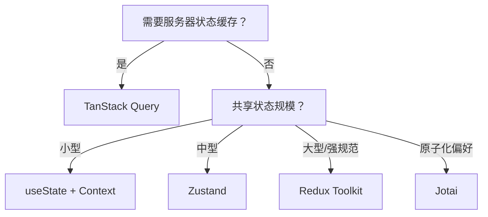

# 状态管理 MOC

> React 状态管理技术栈的知识地图。

## 状态管理库

### 轻量级方案
- [[Zustand]] - 极简 API，无需 Provider，适合中小型应用 ⭐推荐
- [[Jotai]] - 原子化状态管理，细粒度更新，函数式风格
- [[Recoil]] - Facebook 出品的原子化方案（实验性）
- [[Valtio]] - 基于 Proxy 的可变状态，可直接修改状态

### 传统方案
- [[Redux]] - 集中式状态管理，适合大型应用，生态最丰富
- [[MobX]] - 响应式编程，自动追踪依赖，OOP 风格
- [[Context API]] - React 内置方案，适合简单场景

### 服务器状态管理
- [[TanStack-Query]] - 服务器状态缓存与同步 ⭐强烈推荐
- [[SWR]] - Stale-While-Revalidate 策略
- [[Apollo Client]] - GraphQL 状态管理

## 核心概念

### 状态设计
- [[选择器模式]] - 精确数据提取与性能优化
- [[中间件模式]] - 扩展 Store 功能
- [[状态持久化]] - 保存和恢复应用状态
- [[不可变性]] - 状态更新原则
- [[原子化状态管理]] - 自下而上的状态组织方式
- [[响应式原理]] - 自动追踪依赖的机制

### 状态分类
- **客户端状态**: UI 状态、主题、表单、用户信息 → Zustand/Jotai/Redux
- **服务器状态**: API 数据、缓存、加载状态 → TanStack Query/SWR
- **表单状态**: 表单字段、验证 → React Hook Form
- **URL 状态**: 路由参数、查询字符串 → React Router

### 性能优化
- [[记忆化]] - useMemo/useCallback
- [[虚拟列表]] - 大数据量渲染
- [[代码分割]] - 懒加载状态模块

## 服务器状态管理

- [[React Query]] - 服务器状态缓存
- [[SWR]] - Stale-While-Revalidate
- [[Apollo Client]] - GraphQL 状态管理

## 工具选型指南

### 快速决策树

### 组合推荐
- **现代 React 应用**: Zustand (客户端) + TanStack Query (服务器)
- **大型企业应用**: Redux Toolkit (客户端) + TanStack Query (服务器)
- **快速原型**: Valtio 或 Zustand
- **性能敏感**: Jotai (细粒度更新)

## 最佳实践

1. **区分状态类型**
   - 客户端状态 → Zustand/Jotai/Redux
   - 服务器状态 → TanStack Query/SWR ⭐必须分离
   - 表单状态 → React Hook Form
   - URL 状态 → React Router

2. **避免过度设计**
   - 小型应用：useState + Context
   - 中型应用：Zustand ⭐
   - 大型应用：Redux Toolkit + TanStack Query

3. **关注点分离**
   - 状态逻辑与 UI 分离
   - 同步状态与异步状态分离
   - 全局状态与局部状态分离

4. **性能优化**
   - 使用选择器避免不必要重渲染
   - 原子化状态实现细粒度更新
   - 服务器状态使用 Stale-While-Revalidate 策略

## 场景示例

后台订单管理页可以这样拆：

- 筛选条件、当前 Tab：URL 状态或轻量客户端状态。
- 订单列表、订单详情：[[TanStack-Query]] 管理服务器状态。
- 侧边栏展开、主题、用户偏好：[[Zustand]] 管理客户端全局状态。
- 复杂批量编辑草稿：按业务复杂度选择局部状态或 [[Redux]]。

这样可以避免把接口数据、UI 开关和表单草稿全部塞进一个 Store。

## 检查清单

- 是否先区分客户端状态、服务器状态、表单状态和 URL 状态。
- 是否避免把 API 响应复制进全局 Store。
- 是否为共享状态设计选择器，降低重渲染范围。
- 是否只持久化必要状态，避免保存敏感信息。
- 是否让状态工具服务业务复杂度，而不是为了技术栈统一而过度引入。

## 相关 MOC

- [[前端开发 MOC]] - 前端技术总览
- [[React MOC]] - React 生态
