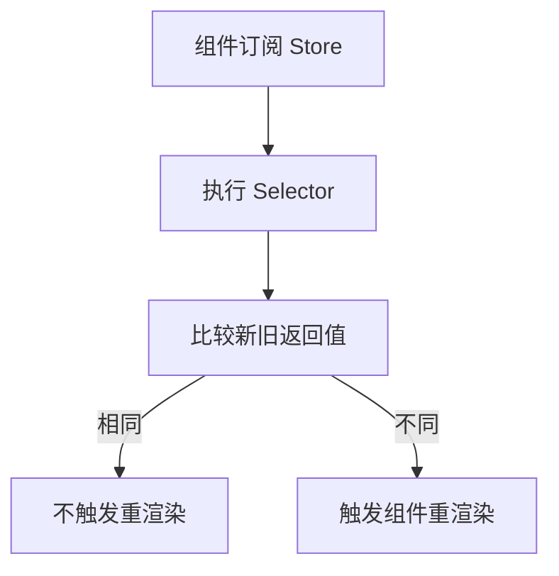

# 选择器模式 (Selector Pattern)

## 定义

选择器模式是一种从状态容器中**精确提取所需数据**的技术，通过比较前后返回值来决定是否触发订阅者更新。

## 工作原理



## 在 Zustand 中的应用

```typescript
// 基础选择器
const count = useStore((state) => state.count)

// 派生选择器
const doubleCount = useStore((state) => state.count * 2)

// 多值选择器 + shallow
const { count, name } = useStore(
  (state) => ({ count: state.count, name: state.name }),
  shallow
)
```

## 优势

- **性能优化**：避免不必要重渲染
- **关注点分离**：组件只获取需要的数据
- **可测试性**：选择器是纯函数

## 浅比较 (Shallow Comparison)

检查对象的**第一层属性**是否严格相等（===）。

```typescript
// 使用 shallow 避免对象引用问题
const data = useStore(
  (state) => ({ a: state.a, b: state.b }),
  shallow
)
```

## 案例

页面 Store 里有用户、筛选条件、表格列配置和弹窗状态。如果组件只需要 `filter.status`，就不应订阅整个 Store：

```typescript
const status = useStore((state) => state.filter.status)
```

这样弹窗开关变化时，筛选组件不会跟着重渲染。

## 检查清单

- 组件是否只订阅自己需要的数据。
- Selector 返回对象时是否使用 shallow 或拆成多个原子选择器。
- 派生数据是否放进 Selector，而不是重复存一份状态。
- Selector 是否保持纯函数，不发请求、不修改状态。
- 是否结合 [[React 渲染优化]] 验证真实收益。

## 相关概念

- [[Zustand]]
- [[中间件模式]]
- [[状态持久化]]
- [[不可变性]]
- [[React 渲染优化]]
