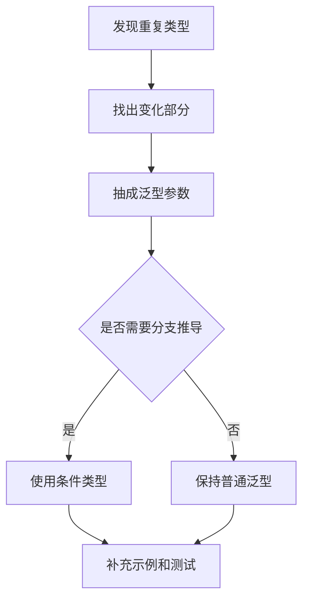

# TypeScript 泛型与条件类型

## 定义

泛型让类型定义保留参数化能力，条件类型根据类型关系选择不同结果，二者是 TypeScript 类型复用和类型推导的重要基础。

## 要点

- 泛型适合表达输入输出之间的类型关系。
- 条件类型常写作 `T extends U ? X : Y`。
- 配合 `infer` 可以从复杂类型中提取局部类型。
- 复杂类型应控制可读性，避免变成维护负担。

## 相关概念

- [[TypeScript 类型系统基础]]
- [[TypeScript 工程实践总览]]

## 使用场景

- 泛型函数：让输入和输出保持同一类型关系。
- 泛型组件：表达列表项、表单值、选项数据等可替换结构。
- 条件类型：根据传入类型推导不同返回值。
- `infer`：从 Promise、数组、函数返回值等复杂类型里提取局部类型。

## 设计流程

## 实践检查清单

- 泛型参数名是否能表达含义，而不是全部写成 `T`。
- 类型推导是否能从调用处自然得出，避免用户手动传太多类型参数。
- 条件类型是否可读，必要时拆成多个命名类型。
- 是否避免递归类型过深导致编辑器变慢。
- 复杂工具类型是否配套示例，降低维护成本。

## 常见误区

- 为了“类型炫技”写出业务同事难以理解的类型。
- 把运行时校验误认为 TypeScript 类型能保证。
- 条件类型分支覆盖不完整，遇到 union 时结果和预期不一致。
