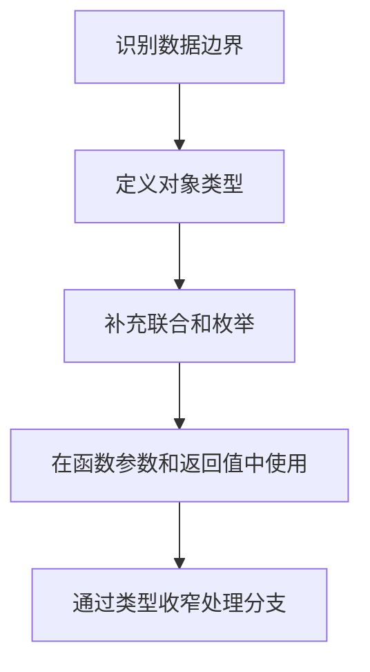

# TypeScript 类型系统基础

## 定义

TypeScript 类型系统在 JavaScript 之上增加静态类型检查，帮助开发者在编译期发现字段、函数、联合类型和模块边界错误。

## 要点

- 基础类型包括 string、number、boolean、array、tuple、enum、unknown、never。
- interface 和 type 都能描述对象结构。
- 联合类型和类型收窄是业务建模核心能力。
- 类型服务于边界表达，不应追求过度复杂。

## 建模流程

## 实践检查清单

- API 响应、表单值和组件 props 是否有明确类型。
- unknown 是否先收窄再使用。
- never 是否用于穷尽检查。
- 类型是否表达业务约束，而不是全部写成 any。
- interface/type 的选择是否遵循团队约定。

## 案例

订单状态可以建模为 `'pending' | 'paid' | 'cancelled'`，渲染时用 switch 处理各状态，并在 default 分支使用 never 做穷尽检查，避免新增状态后遗漏 UI。

## 常见误区

- 为了绕过报错大量使用 `any`，失去类型系统价值。
- 类型写得过度复杂，团队难以维护。
- 只给内部变量补类型，却忽视 API、组件 props 和模块边界。
- 不做类型收窄，直接断言导致运行时错误。

## 复盘提示

TypeScript 的重点是表达边界和业务不变量。类型越靠近输入输出边界，收益越大；类型越脱离业务语义，越容易变成形式负担。

## 相关概念

- [[TypeScript 工程实践总览]]
- [[TypeScript 泛型与条件类型]]
