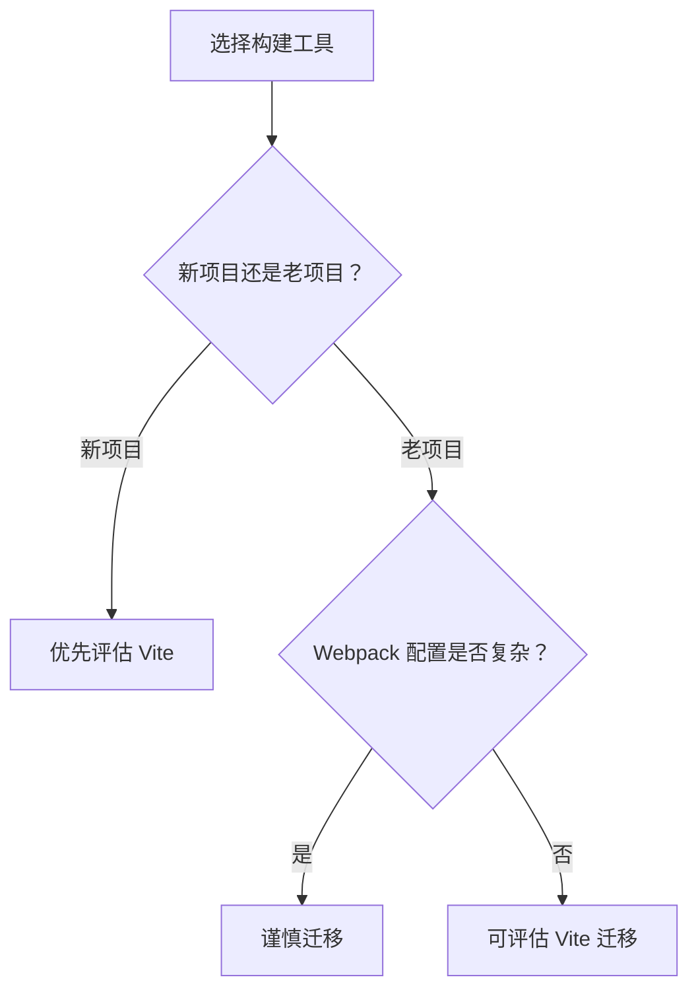

# Vite 与 Webpack 的差异对比

## 定义

Vite 与 Webpack 都是前端工程化工具，但 Vite 开发环境基于原生 ESM 和按需转换，Webpack 更偏完整依赖图打包与高度可配置。

## 对比要点

- 开发启动：Vite 通常更快，Webpack 需要构建依赖图。
- 生产构建：Vite 默认使用 Rollup，Webpack 使用自身打包器。
- 生态成熟度：Webpack 老项目和复杂配置更多。
- 插件模型：Vite 兼容 Rollup 插件并扩展开发服务器钩子。

## 选择流程

## 实践检查清单

- 项目是否依赖 Webpack 特有 loader/plugin。
- 开发启动慢是否是主要痛点。
- 生产构建产物是否满足兼容性要求。
- Monorepo、别名、环境变量和代理是否能迁移。
- 迁移是否有对照构建和回归测试。

## 案例

新建 React 中后台项目通常可以优先用 Vite；但大型老项目若依赖复杂 webpack loader、模块联邦或特殊构建链路，迁移前需要逐项验证。

## 迁移风险

迁移构建工具不只是替换命令，还涉及环境变量、路径别名、静态资源处理、测试配置、代理规则和 CI 缓存。迁移前应保留旧构建产物作为对照，确认功能和体积没有明显回退。

## 相关概念

- [[Vite 原理与插件机制总览]]
- [[Webpack]]
- [[包管理与依赖治理]]
