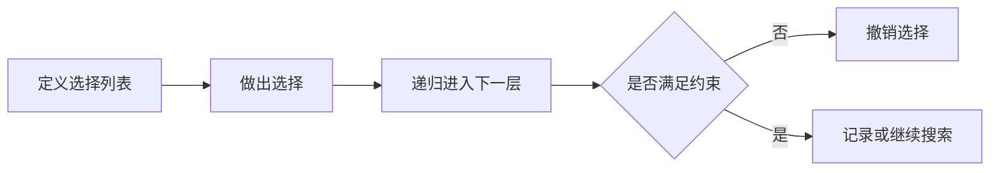

# 回溯算法

- 回溯算法实际上一个类似枚举的搜索尝试过程，主要是在搜索尝试过程中寻找问题的解，当发现已不满足求解条件时，就“回溯”返回，尝试别的路径
- 回溯法是一种选优搜索法，按选优条件向前搜索，以达到目标。但当探索到某一步时，发现原先选择并不优或达不到目标，就退回一步重新选择，这种走不通就退回再走的技术为回溯法，而满足回溯条件的某个状态的点称为“回溯点”

为了有规律地枚举所有可能的解，避免遗漏和重复，我们把问题求解的过程分为多个阶段

每个阶段，我们都会面对一个岔路口，我们先随意选一条路走，当发现这条路走不通的时候（不符合期望的解），就回退到上一个岔路口，另选一种走法继续走

## 回溯思想

- 回溯算法非常适合用递归代码实现，或者使用栈来模拟
- 剪枝操作是提高回溯效率的一种技巧。利用剪枝，我们并不需要穷举搜索所有的情况，从而提高搜索效率

## 0-1背包问题

我们有一个背包，背包总的承载重量是 Wkg。现在我们有 n 个物品，每个物品的重量不等，并且不可分割。我们现在期望选择几件物品，装载到背包中。在不超过背包所能装载重量的前提下，如何让背包中物品的总重量最大？

回溯算法

```js
const pack = [23, 12, 5, 2, 9]
function maxWeight(pack, max, sum = 0, i = 0) {
  // 已全部遍历
  if (i >= pack.length) return sum
  // 超出重量
  if (sum + pack[i] > max) return sum
  // 返回选与不选的最大重量
  return Math.max(
    maxWeight(pack, max, sum + pack[i], i + 1),
    maxWeight(pack, max, sum, i + 1)
  )
}
console.log(maxWeight(pack, 45))
```

## 实践流程



## 实践检查清单

- 是否明确路径、选择列表和结束条件。
- 是否在递归返回时撤销本层选择。
- 是否能用剪枝提前排除无效分支。
- 是否注意重复解和顺序问题。
- 数据规模较大时是否需要记忆化或动态规划替代。

## 案例

全排列问题中，每一层选择一个未使用数字加入路径；当路径长度等于数组长度时记录答案，然后回退并尝试其他数字。

## 常见误区

- 忘记撤销选择，导致路径污染。
- 没有剪枝，搜索空间爆炸。
- 把回溯和贪心混用，漏掉最优解或全部解。
