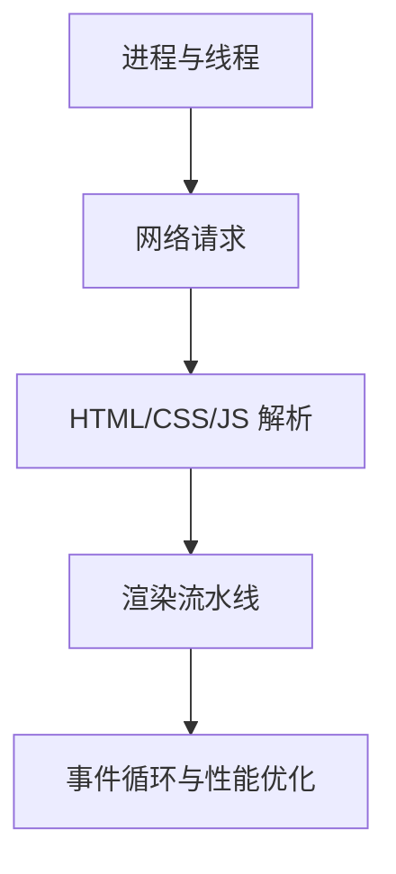

# 浏览器系列

- 本系列主要是让我们深入了解浏览器的一些原理和机制
- 前端最熟悉的宿主环境就是浏览器，所有前端代码都在浏览器环境下运行，因此深入了解其工作原理对我们编程会有很大帮助

## 为什么要了解浏览器

- 浏览器作为网站的依赖环境，我们只有深入了解它的底层细节，才能对这个维度有更加深入的体会，简单说就是可以开阔视野，扩大格局
- 也许你可能只会使用api，只会依葫芦画瓢，也许你只是个停留在使用这些技术的层面，也许你只是个素人，但是你想有更强的竞争力，那当然是要拥有异于常人的知识面，深入了解浏览器，这将会给你的构建更加清晰的知识体系
- 比如一盘很好吃的菜，你有没有试图想要了解其制作过程，那你只是短暂的享受，如果你学会了如何制作，那么你随时都可以享受美味，在科学领域具有刨根问底的精神是很可贵的，只有这样你才能站得更牢，看的更远，更不会轻易的被时代抛弃

## 能学到什么

- 常见的浏览器厂家，以及他们的特性
- 浏览器的主要构成
- 浏览器的工作原理，以及各个进程、线程之间的配合
- 前端代码在浏览器中的执行过程
- 浏览器的渲染机制
- 浏览器是怎么对服务器发起请求，以及请求的过程

## 浏览器的重要性

- 浏览器在当今互联网时代，成为我们访问互联网的主要工具
- 之前的c/s架构，主要是通过特定的应用软件访问特定的服务器，局限在软件本身的设定
- 如今流行的b/s架构，通过浏览器直接访问服务器，我们只需要把代码放在客户端的浏览器上就能实现访问我们的服务器
- 通过浏览器的搜索引擎，访问互联网上的资源，更加便捷，在浏览器上访问网站，而不需要下载软件，且只需要有浏览器就能访问到我们的服务器，跨平台能力增强
- 浏览器就是我们打开互联网的窗口，通过这个窗口你能够进入错综复杂的虚拟世界，而我们前端就是这个世界的建筑师，构建一个个宏伟的建筑，给那些通过浏览器进入这个世界的人使用

## 学习路径

## 工程场景

当页面出现白屏、卡顿、资源加载慢、接口跨域、缓存不生效或内存泄漏时，都需要回到浏览器机制排查。浏览器知识连接 [[JavaScript]]、[[CSS]]、[[HTTPS]]、[[前端性能优化清单]] 和安全策略，是定位线上前端问题的底层地图。

## 检查清单

- 是否能描述从输入 URL 到页面渲染的主流程。
- 是否理解事件循环、宏任务、微任务和渲染时机。
- 是否知道强缓存、协商缓存和 Service Worker 的差异。
- 是否能用 DevTools 分析网络、性能、内存和渲染问题。
- 是否理解同源策略、CORS、Cookie 和浏览器安全边界。
