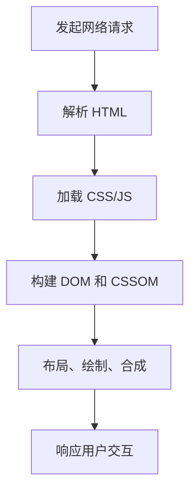

# 浏览器

## 定义

浏览器是 Web 应用的运行环境，负责网络请求、HTML/CSS/JavaScript 解析、渲染、事件处理、安全隔离和存储能力。

## 要点

- 渲染流程包括解析、样式计算、布局、绘制和合成。
- JavaScript 在主线程运行，长任务会影响交互响应。
- 同源策略、CORS、Cookie 和 CSP 构成重要安全边界。
- 性能优化需要同时关注网络、渲染、脚本和资源缓存。

## 页面加载流程

## 排查案例

页面白屏时，可以按网络、脚本、渲染三层排查：先看 HTML 和静态资源是否加载成功，再看控制台是否有运行时错误，最后用 Performance 面板定位长任务、布局抖动或资源阻塞。

## 检查清单

- 是否能解释 DOM、CSSOM、Render Tree 的关系。
- 是否理解主线程阻塞对交互的影响。
- 是否能用 DevTools 查看网络、性能、内存和安全问题。
- 是否知道缓存、预加载和懒加载对体验的影响。
- 是否理解浏览器安全策略和跨域边界。

## 复盘提示

浏览器问题排查要先定层次：网络失败看 Network，脚本异常看 Console，交互卡顿看 Performance，内存增长看 Memory，安全限制看 Security 和响应头。定位层次清楚后，工具输出才有解释价值。

## 相关概念

- [[browser/Browser]]
- [[Web Vitals 核心指标]]
- [[异步编程]]
- [[网络]]
