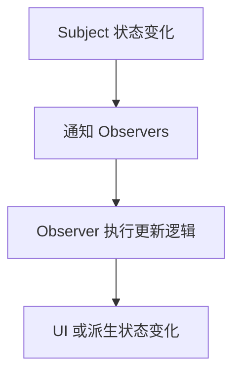

# Observer 模式

Observer 模式让对象在状态变化时通知订阅者，常用于响应式系统、事件系统和状态管理。

## 工作流程

## 核心角色

- Subject：被观察对象，维护订阅者列表。
- Observer：观察者，接收变化通知。
- Subscribe/Unsubscribe：注册和取消订阅。
- Notify：状态变化后触发通知。

## 实践检查清单

- 订阅和取消订阅是否成对出现。
- 通知时是否避免死循环和重复更新。
- 观察者之间是否互相强耦合。
- 异步通知是否需要调度或批处理。
- 是否有调试手段追踪谁触发了更新。

## 案例

Vue 响应式系统中，数据变化会通知依赖它的 watcher 更新；浏览器事件监听也是观察者模式的一种形式，事件源变化后通知监听器执行回调。

## 常见误区

- 只订阅不取消，造成内存泄漏。
- 通知链过长，导致变化来源难追踪。

## 相关概念

- [[设计模式]]
- [[MobX]]
- [[响应式原理]]
