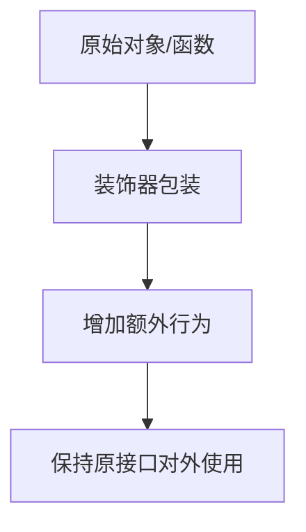

# 装饰器模式

装饰器模式是在不修改原对象核心逻辑的情况下，为对象或函数叠加额外能力。前端中常见于中间件、日志、权限、缓存和框架装饰器语法。

## 结构流程

## 适用场景

- 给函数增加日志、鉴权、缓存、埋点。
- 给组件增加权限控制或加载状态。
- 给请求流程叠加重试、超时、错误处理。
- 保持原对象接口不变，逐层增强能力。

## 实践检查清单

- 装饰器是否保持原接口语义。
- 额外能力是否和核心逻辑解耦。
- 多层装饰顺序是否清楚。
- 错误处理是否不会吞掉关键异常。
- 是否比继承或直接组合更简单。

## 案例

请求函数可以被超时装饰器、重试装饰器和日志装饰器包裹，业务调用仍然使用同一个接口。这样横切关注点不会散落到每个请求实现中。

## 判断标准

适合使用装饰器的信号是：同一类增强逻辑会出现在多个对象或函数上，并且这些增强逻辑不应该污染核心业务。例如日志、鉴权、缓存、埋点、错误转换都属于横切关注点。若增强逻辑只服务一个函数，直接写在函数内部通常更清楚。

装饰器应尽量保持透明：调用方感知到的是同一个接口和同一种返回语义。若装饰器改变参数含义、吞掉异常或悄悄改变返回类型，就会让调试成本快速上升。

多层装饰时应固定顺序并写测试。例如“鉴权、缓存、日志、重试”的顺序不同，可能影响是否记录失败、是否缓存错误、是否重复执行副作用。越靠近基础设施的装饰器越需要保持通用，越靠近业务的装饰器越要明确边界。

## 常见误区

- 装饰器层级过多，调用链难追踪。
- 在装饰器里修改核心业务语义。

## 相关概念

- [[设计模式]]
- [[中间件模式]]
- [[函数式编程]]
