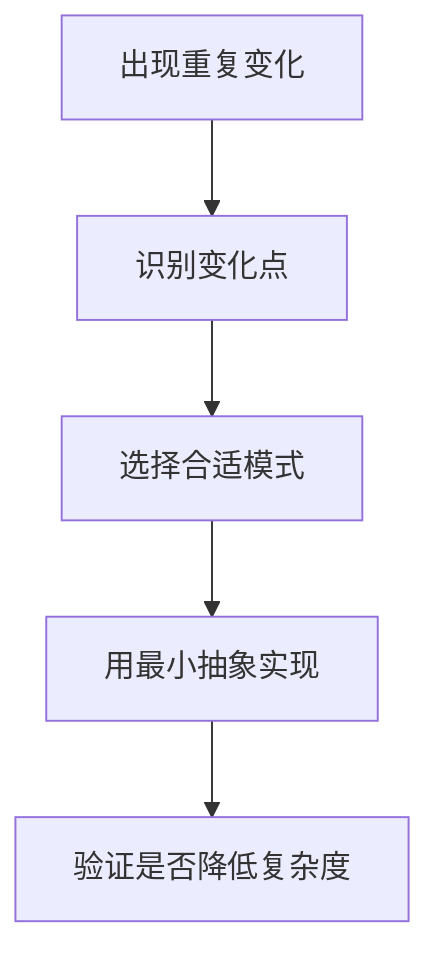

# 设计模式

## 定义

设计模式是针对常见软件设计问题的可复用解决思路。前端中常见模式包括观察者、发布订阅、装饰器、策略、适配器、中间件和组合模式。

## 要点

- 设计模式服务于代码边界和变化管理，不是为了套概念。
- 在 UI 组件、状态管理、插件系统和请求中间件中很常见。
- 过度抽象会增加理解成本。

## 选择流程

## 检查清单

- 是否真的存在重复问题。
- 模式是否让代码边界更清晰。
- 是否降低了修改成本，而不是增加层级。
- 团队是否能理解这个抽象。
- 是否有测试保护模式带来的间接调用。

## 案例

请求拦截、日志、鉴权和错误处理适合用 [[中间件模式]] 串联；不同支付渠道选择不同计算逻辑时，可以用策略模式封装变化。

## 常见误区

- 为了使用模式而使用模式，导致简单逻辑被过度包装。
- 抽象过早，变化点还没出现就先设计多层结构。
- 只记模式名称，不理解它解决的变化方向。
- 一个模式套所有问题，忽视语言和框架已有机制。

## 复盘提示

设计模式复盘时要写清三件事：原始问题是什么，变化点在哪里，模式如何降低修改成本。若说不清这三点，说明当前抽象可能只是增加术语，而没有提升工程质量。

## 延伸应用

在前端架构中，设计模式常和框架机制混合出现：React 的组件组合接近组合模式，请求拦截器接近责任链，中间件生态接近管道模式。识别这些模式能帮助理解代码，但实现时仍应优先服从项目已有风格。

## 相关概念

- [[中间件模式]]
- [[装饰器模式]]
- [[Observer 模式]]
