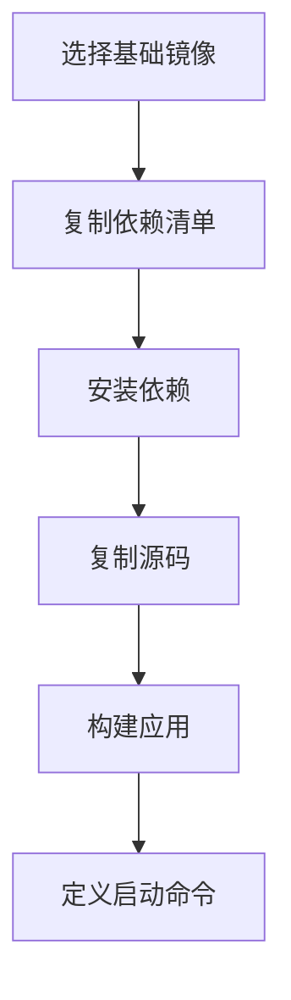

# docker-dockerfile

Dockerfile 是构建 Docker 镜像的声明文件，描述基础镜像、依赖安装、文件复制、构建命令和启动命令。

## 要点

- 多阶段构建可减少最终镜像体积。
- 依赖安装层应尽量利用缓存。
- 不要把密钥写进镜像。

## 编写流程

## 检查清单

- 基础镜像是否固定版本。
- 是否使用 `.dockerignore` 排除本地缓存和密钥。
- 依赖安装层是否能复用缓存。
- 生产镜像是否通过多阶段构建瘦身。
- CMD/ENTRYPOINT 是否符合运行方式。

## 案例

前端项目可用 Node 镜像完成构建，再把 `dist` 复制到 Nginx 镜像。这样最终镜像只包含静态资源和 Nginx，不包含源码和开发依赖。

## 常见误区

- 先复制全部源码再安装依赖，导致每次代码变化都让依赖缓存失效。
- 忘记 `.dockerignore`，把 `node_modules`、日志、密钥和本地缓存打进镜像。
- 使用 `latest` 基础镜像，导致构建结果不可复现。
- 把构建工具留在生产镜像中，增加体积和攻击面。

## 复盘提示

Dockerfile 不是能跑就结束，还要看可复现、可缓存、可扫描和可回滚。每次镜像变大、构建变慢或线上环境差异，都应回到 Dockerfile 分层顺序和构建上下文排查。

## 验收方式

验收 Dockerfile 时应至少构建一次镜像、运行容器、检查镜像体积、确认启动命令和环境变量，并确保镜像不包含密钥或本地临时文件。

## 相关概念

- [[Docker]]
- [[docker-镜像]]
