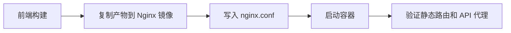

# docker-nginx

docker-nginx 是用 Nginx 镜像托管静态资源、反向代理 API 或作为前端容器运行时的常见方式。

## 要点

- 前端构建产物可复制到 Nginx 静态目录。
- SPA 需要配置路由 fallback。
- 反向代理时要正确传递 Host、X-Forwarded-* 等头。

## 相关概念

- [[Nginx 反向代理与 HTTPS 配置]]
- [[docker-dockerfile]]
- [[前后端项目部署方案详解]]

## 常见用途

- 静态站点托管：把构建产物放到 `/usr/share/nginx/html`。
- SPA 路由 fallback：刷新深层路径时回退到 `index.html`。
- API 反向代理：前端同域访问 `/api`，Nginx 转发到后端服务。
- 缓存和压缩：对静态资源设置长期缓存、gzip 或 brotli。

## 部署流程

## 实践检查清单

- HTML 是否短缓存，带 hash 的 JS/CSS 是否长缓存。
- SPA 是否配置 `try_files $uri /index.html`。
- 反向代理是否传递 `Host`、`X-Real-IP`、`X-Forwarded-For`。
- 容器是否以只读静态文件方式运行，避免在容器内手工改配置。
- 健康检查是否覆盖静态页面和关键代理路径。

## 常见误区

- 所有资源都长缓存，导致新版本 HTML 无法及时更新。
- API 代理没有设置超时，后端异常时请求长期挂起。
- 在镜像构建阶段写死环境地址，导致同一镜像无法多环境复用。
