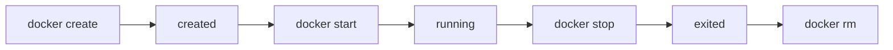

# docker-容器

## 定义

Docker 容器是镜像运行后的实例，拥有隔离的进程、文件系统、网络和资源视图。镜像是静态模板，容器是运行中的进程集合。

## 要点

- 容器应尽量无状态，状态放到数据卷或外部服务。
- 一个容器通常运行一个主进程。
- 日志应输出到标准输出，交给平台采集。

## 生命周期



容器删除后，容器写入层也会删除。因此数据库数据、上传文件、开发缓存等必须放在 [[docker-数据卷]] 或外部服务中。

## 常用操作

```bash
docker ps
docker logs app
docker exec -it app sh
docker stop app
docker rm app
```

`docker exec` 适合临时排查，不应该把手工进入容器修改配置当成正式发布方式。

## 检查清单

- 容器是否只运行必要主进程。
- 日志是否输出到 stdout/stderr。
- 配置是否通过环境变量或配置文件注入，而不是写死在镜像里。
- 数据是否放到 volume 或外部存储。
- 健康检查和资源限制是否配置清楚。

## 常见误区

- 把容器当虚拟机，在里面手工安装依赖和改配置。
- 把数据库数据写在容器层，删除容器后数据丢失。
- 镜像启动命令依赖本机路径，换环境后无法运行。
- 容器内应用只写文件日志，平台无法统一采集。

## 相关概念

- [[docker-镜像]]
- [[docker-数据卷]]
- [[Docker]]
