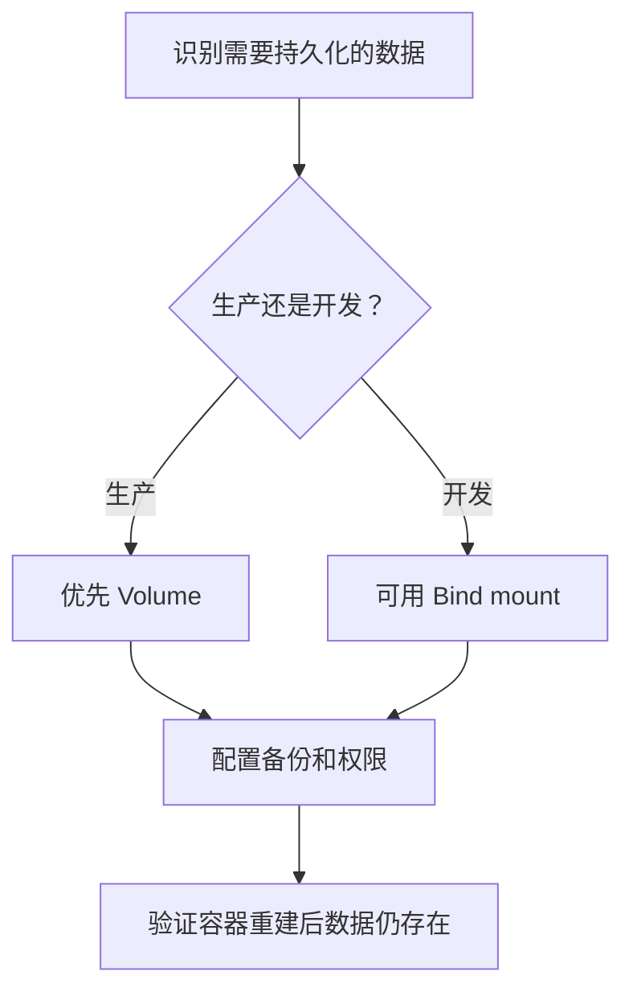

# docker-数据卷

Docker 数据卷用于把容器中的数据持久化到容器生命周期之外，常用于数据库、缓存和上传文件目录。

## 要点

- Volume 由 Docker 管理，适合持久化数据。
- Bind mount 直接挂载宿主机路径，适合开发调试。
- 删除容器不等于删除数据卷。

## 使用流程

## 案例

本地启动 MySQL、PostgreSQL 或 Redis 时，应把数据目录挂载到数据卷。这样容器删除或镜像升级后，数据仍能保留；但如果要彻底重置环境，需要显式删除对应 Volume。

## 检查清单

- 哪些目录需要跨容器生命周期保留。
- 开发环境是否需要直接编辑宿主机文件。
- 数据卷是否有备份、迁移和清理策略。
- 容器内用户是否有读写权限。
- 是否避免把敏感文件挂载进不可信容器。

## 常见误区

- 以为删除容器会自动删除数据卷，结果旧数据影响新环境。
- 生产环境直接使用宿主机任意路径挂载，造成权限和迁移问题。
- 多个容器同时写同一目录，却没有明确并发写入语义。
- 没有备份策略，直到数据库容器异常才发现数据不可恢复。

## 复盘提示

本地环境异常时，先确认问题来自镜像、容器还是数据卷。若旧数据一直影响新容器，可以列出 volume、确认挂载关系，再决定备份、迁移或删除，而不是盲目重建镜像。

## 相关概念

- [[docker-compose]]
- [[docker-容器]]
- [[Docker]]
