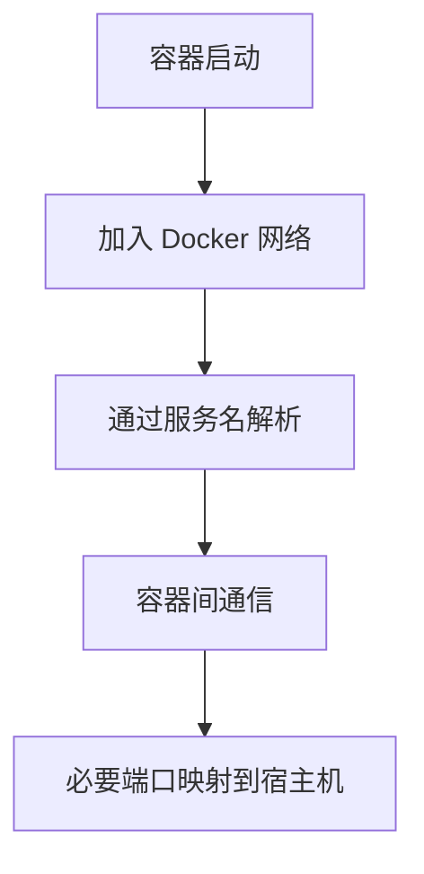

# docker-网络

Docker 网络用于连接容器、宿主机和外部服务。常见模式包括 bridge、host、none 和自定义网络。

## 要点

- Compose 中同一网络内服务可用服务名互相访问。
- 端口映射负责把容器端口暴露到宿主机。
- 生产环境需要明确只暴露必要端口。

## 连接流程

## 检查清单

- 服务间访问是否使用容器服务名，而不是 localhost。
- 哪些端口需要暴露到宿主机。
- 数据库、缓存等内部服务是否避免公网暴露。
- Compose 网络名称是否清晰。
- 是否区分开发网络和生产网络边界。

## 案例

在 Docker Compose 中，后端连接 Redis 应使用 `redis:6379`，而不是 `localhost:6379`。localhost 在容器内指向容器自身，不是宿主机或其他容器。

## 常见误区

- 在容器内使用 `localhost` 访问其他服务，导致连接失败。
- 把数据库端口暴露到宿主机甚至公网，扩大攻击面。
- 没有区分内部网络和外部访问入口。
- 多个 compose 项目网络同名，造成服务解析混乱。

## 复盘提示

排查 Docker 网络问题时，先确认调用方在哪个网络命名空间，再确认目标服务名、端口和网络是否一致。不要直接从宿主机视角推断容器内访问路径。

## 验收方式

网络配置完成后，应分别从宿主机、前端容器、后端容器和数据库容器验证连通性。不同位置看到的 localhost 含义不同，这一点必须单独确认。

## 相关概念

- [[docker-compose]]
- [[docker-容器]]
- [[Docker]]
