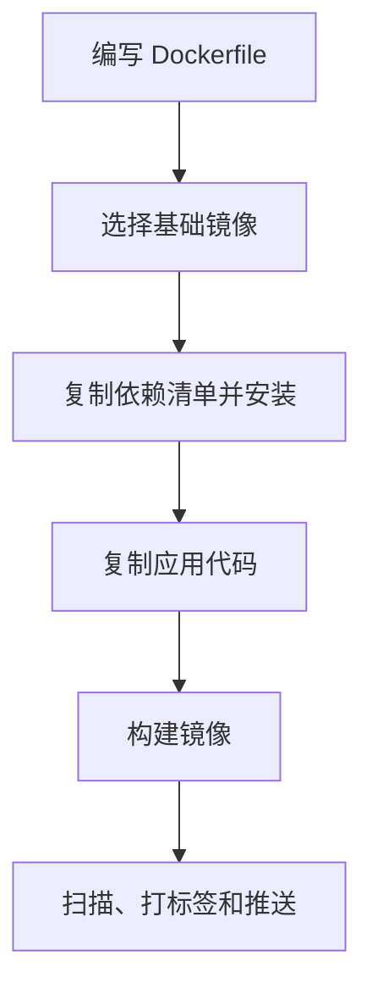

# docker-镜像

Docker 镜像是应用及运行依赖的不可变交付物，由多层文件系统组成，可被分发并启动为容器。

## 要点

- 镜像标签应表达版本，不要只依赖 `latest`。
- 小镜像更利于分发和安全扫描。
- 构建过程应可复现。

## 构建流程

## 案例

前端应用通常先在 Node 镜像中执行依赖安装和构建，再把静态产物复制到 Nginx 镜像中运行。这样可以减少最终镜像体积，也避免把源码、构建缓存和开发依赖带到生产环境。

## 检查清单

- 是否固定基础镜像版本。
- 是否利用分层缓存，把依赖安装放在代码复制之前。
- 是否排除 `node_modules`、日志和本地配置。
- 是否使用多阶段构建减少生产镜像体积。
- 是否为镜像配置安全扫描和版本标签。

## 常见误区

- 使用 `latest` 导致不同时间构建出不同结果。
- 把密钥、`.env` 或本地缓存复制进镜像。
- 每次都先复制全部源码再安装依赖，导致缓存失效。
- 生产镜像保留测试工具和开发依赖，扩大攻击面。

## 复盘提示

镜像问题通常从三处排查：构建上下文是否过大、层缓存是否失效、运行环境是否包含不该进入生产的文件。每次构建变慢或体积变大，都应回看 Dockerfile 的复制顺序和 `.dockerignore`。

生产镜像的目标是可复现、可扫描、可回滚，而不只是能启动。

## 相关概念

- [[docker-dockerfile]]
- [[docker-容器]]
- [[Docker]]
