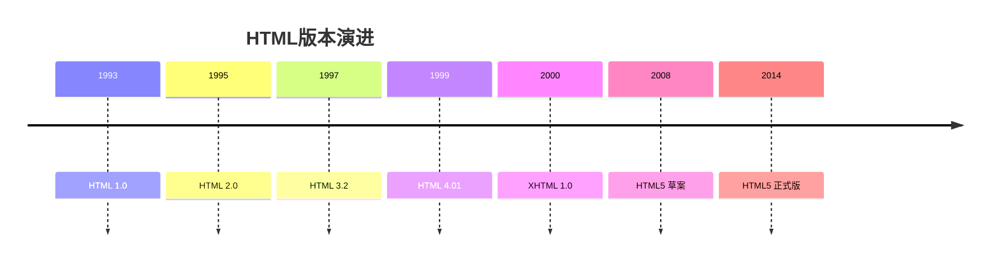

# HTML基础入门

> [!info] 什么是HTML
> HTML（HyperText Markup Language，超文本标记语言）是构建网页的标准标记语言，用于描述网页的结构和内容。

## HTML是什么

- HTML是**网站的骨架**，所有的CSS与JavaScript都是基于HTML元素的操作
- 通过CSS给HTML元素添加样式修饰
- 通过JavaScript给HTML元素添加互动效果

> [!note] 超文本的含义
> 超文本是一种组织信息的方式，通过**超级链接**将文本中的文字、图表与其他信息媒体相关联。

## HTML的历史与版本



- **HTML 4.01** - 传统网页开发的基础版本
- **HTML5** - 现代网页开发的标准，支持多媒体、Canvas、语义化标签等

## 基本语法规则

### 标签结构

> [!tip] 标签是HTML的基本单位

- **双边标签**：`<标签名>内容</标签名>`
- **单边标签**：`<标签名 />`（如：`<br />`, `<hr />`, ``）

### 书写规范

```html
<!-- 规范示例 -->
<div class="container">
    <p>这是段落内容</p>
</div>

<!-- 不规范示例 -->
<DIV CLASS="container"><P>这是段落内容</P></DIV>
```

> [!warning] 注意事项
> - 标签名建议**小写**
> - 标签之间要**顺序嵌套**
> - 标签属性与标签名之间要有**空格**

### 文档基本结构

```html
<!DOCTYPE html>
<html lang="zh-CN">
<head>
    <meta charset="UTF-8">
    <title>文档标题</title>
</head>
<body>
    <!-- 页面内容 -->
</body>
</html>
```

## 元素分类

### 块级元素 vs 行内元素

| 特性 | 块级元素 | 行内元素 |
|------|----------|----------|
| 独占一行 | ✅ | ❌ |
| 设置宽高 | ✅ | ❌ |
| 默认宽度 | 100% | 内容宽度 |
| 常见标签 | div, p, h1-h6, ul, ol | span, a, strong, em |

### 常见元素分类

**块级元素：**
- 排版标签：`p`, `h1`-`h6`, `div`, `section`
- 列表标签：`ul`, `ol`, `li`, `dl`, `dt`, `dd`
- 表格标签：`table`, `tr`, `td`, `th`

**行内元素：**
- 文本标签：`b`, `i`, `u`, `span`, `strong`, `em`
- 特殊文本：`sup`, `sub`, `del`, `mark`

## 注释与实体

### HTML注释

```html
<!-- 这是HTML注释，不会在页面显示 -->
```

### 字符实体

| 显示 | 实体代码 | 说明 |
|------|----------|------|
| 空格 | `&nbsp;` | 非断行空格 |
| < | `&lt;` | 小于号 |
| > | `&gt;` | 大于号 |
| & | `&amp;` | 与号 |
| ¥ | `&yen;` | 人民币符号 |
| © | `&copy;` | 版权符号 |
| ® | `&reg;` | 注册商标 |
| × | `&times;` | 乘号 |
| ÷ | `&divide;` | 除号 |

## 下一步学习

> [!question] 继续深入学习
> 掌握了基础概念后，建议学习：
> - [[02-HTML标签详解|HTML标签详解]] - 详细学习各种标签
> - [[03-Meta标签详解|Meta标签详解]] - 理解元信息配置

---
*相关链接：[[00-HTML-MOC|返回知识地图]]*