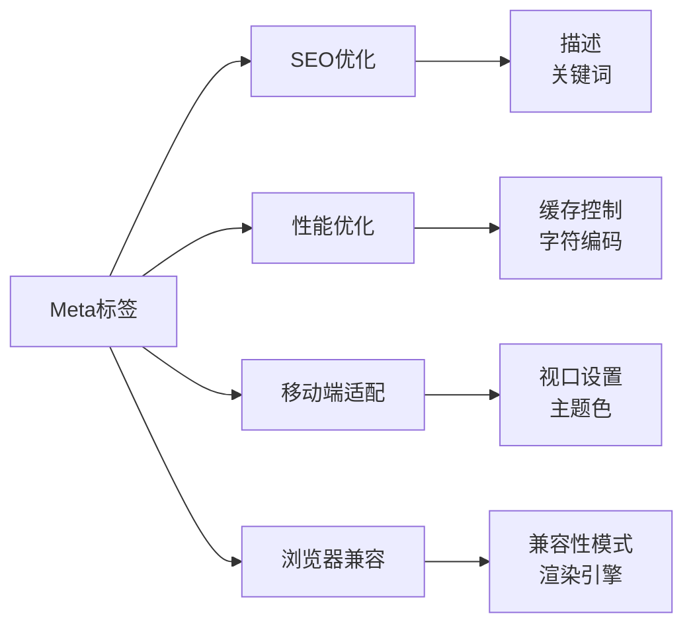

# Meta标签详解

> [!info] 什么是Meta标签
> `<meta>` 标签提供有关页面的**元信息**（meta-information），如页面描述、关键词、作者、字符编码等。

## 基本特性

- 位于文档的 `<head>` 部分
- **不包含任何可见内容**
- 通过属性定义名称/值对

```html
<head>
    <meta charset="UTF-8">
    <meta name="description" content="页面描述">
    <meta http-equiv="X-UA-Compatible" content="IE=edge">
</head>
```

## 核心属性

### 1. charset 字符编码

> [!important] HTML5新增
> 定义文档的字符编码，**必须放在head的最前面**

```html
<meta charset="UTF-8">
```

| 编码 | 说明 |
|------|------|
| UTF-8 | **推荐**，支持全球所有字符 |
| GB2312 | 简体中文，仅6000+汉字 |
| GBK | 简体中文，20000+汉字 |

### 2. name + content

> [!tip] SEO关键
> 用于定义页面元信息，对搜索引擎优化(SEO)非常重要

#### 常用name属性

```html
<!-- 页面描述 - 搜索引擎显示在搜索结果中 -->
<meta name="description" content="这是一个关于HTML学习的详细教程">

<!-- 关键词 - 帮助搜索引擎分类 -->
<meta name="keywords" content="HTML, 前端开发, 网页设计, 教程">

<!-- 页面作者 -->
<meta name="author" content="开源技术团队">

<!-- 版权信息 -->
<meta name="copyright" content="2018-2024 demo.com">

<!-- 搜索引擎索引方式 -->
<meta name="robots" content="all">
```

**robots属性值：**

| 值 | 说明 |
|----|------|
| `all` | 默认，索引所有内容 |
| `none` | 不索引，不跟随链接 |
| `index` | 索引该页面 |
| `noindex` | 不索引该页面 |
| `follow` | 跟随页面中的链接 |
| `nofollow` | 不跟随页面中的链接 |

#### 移动端视口设置

```html
<meta name="viewport" content="width=device-width, initial-scale=1.0, maximum-scale=1.0, user-scalable=no">
```

**viewport参数详解：**

| 参数 | 说明 | 示例 |
|------|------|------|
| `width` | 视口宽度 | `device-width` 或具体数值 |
| `height` | 视口高度 | `device-height` 或具体数值 |
| `initial-scale` | 初始缩放比例 | `1.0` (范围 0-10) |
| `minimum-scale` | 最小缩放比例 | `0.5` |
| `maximum-scale` | 最大缩放比例 | `2.0` |
| `user-scalable` | 是否允许用户缩放 | `yes` / `no` |

> [!warning] 建议
> 现代响应式设计建议设置 `width=device-width, initial-scale=1.0`，一般不限制用户缩放(`user-scalable=yes`)

#### iOS WebApp设置

```html
<!-- 是否允许全屏模式 -->
<meta name="apple-mobile-web-app-capable" content="yes">

<!-- 状态栏样式 -->
<meta name="apple-mobile-web-app-status-bar-style" content="black-translucent">
<!-- 可选值：default | black | black-translucent -->

<!-- 主屏图标 -->
<link rel="apple-touch-icon" href="icon.png">
```

### 3. http-equiv + content

> [!abstract] HTTP头部信息
> 模拟HTTP响应头，在发送到浏览器之前添加到文档头部

```html
<!-- 浏览器兼容性 -->
<meta http-equiv="X-UA-Compatible" content="IE=edge,chrome=1">
```

#### 常用http-equiv属性

**缓存控制：**
```html
<!-- 禁止浏览器缓存 -->
<meta http-equiv="pragma" content="no-cache">

<!-- 页面过期时间 -->
<meta http-equiv="expires" content="Fri, 12 Jan 2025 18:18:18 GMT">
```

**自动刷新/跳转：**
```html
<!-- 5秒后刷新页面 -->
<meta http-equiv="refresh" content="5">

<!-- 5秒后跳转到指定URL -->
<meta http-equiv="refresh" content="5; url=https://example.com">
```

**Cookie设置：**
```html
<meta http-equiv="set-cookie" content="name=value; expires=Fri, 12 Jan 2025 18:18:18 GMT; path=/">
```

## 完整的Meta模板

```html
<!DOCTYPE html>
<html lang="zh-CN">
<head>
    <!-- 1. 字符编码 - 必须第一行 -->
    <meta charset="UTF-8">
    
    <!-- 2. 视口设置 - 移动端必需 -->
    <meta name="viewport" content="width=device-width, initial-scale=1.0">
    
    <!-- 3. 浏览器兼容性 -->
    <meta http-equiv="X-UA-Compatible" content="IE=edge,chrome=1">
    
    <!-- 4. SEO元信息 -->
    <meta name="description" content="页面描述，150字以内">
    <meta name="keywords" content="关键词1, 关键词2">
    <meta name="author" content="作者名称">
    <meta name="robots" content="index,follow">
    
    <!-- 5. 主题色（移动端浏览器标题栏） -->
    <meta name="theme-color" content="#4285f4">
    
    <!-- 6. 禁止电话号码自动识别 -->
    <meta name="format-detection" content="telephone=no">
    
    <!-- 7. 页面标题 -->
    <title>页面标题</title>
</head>
<body>
    <!-- 页面内容 -->
</body>
</html>
```

## Meta标签的作用总结



| 作用领域 | 相关Meta标签 |
|----------|--------------|
| **SEO优化** | description, keywords, robots |
| **性能优化** | charset, cache-control |
| **移动端适配** | viewport, theme-color |
| **浏览器兼容** | X-UA-Compatible |
| **WebApp** | apple-mobile-web-app-* |

## 最佳实践

> [!success] 推荐做法
> 1. **charset必须放在`<head>`的第一行**
> 2. 每个页面都应有独特的description
> 3. keywords不要堆砌，3-5个即可
> 4. 移动端页面必须设置viewport
> 5. 根据项目需要设置http-equiv缓存策略

> [!warning] 避免的做法
> - ❌ 关键词堆砌：`content="HTML, HTML教程, HTML入门, HTML基础..."`
> - ❌ 所有页面使用相同的description
> - ❌ 不设置charset导致乱码

---
*相关链接：[[00-HTML-MOC|返回知识地图]] | [[04-HTML特殊属性|下一步：特殊属性]]*