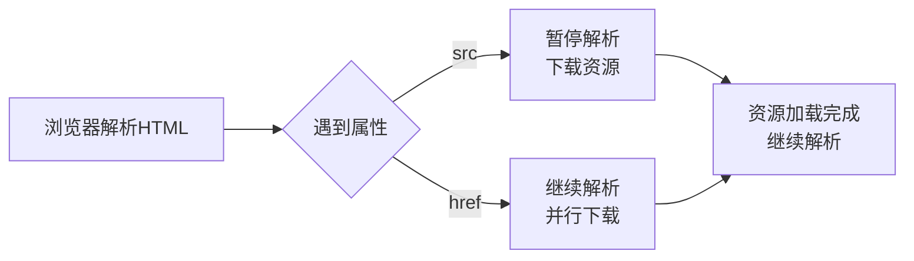
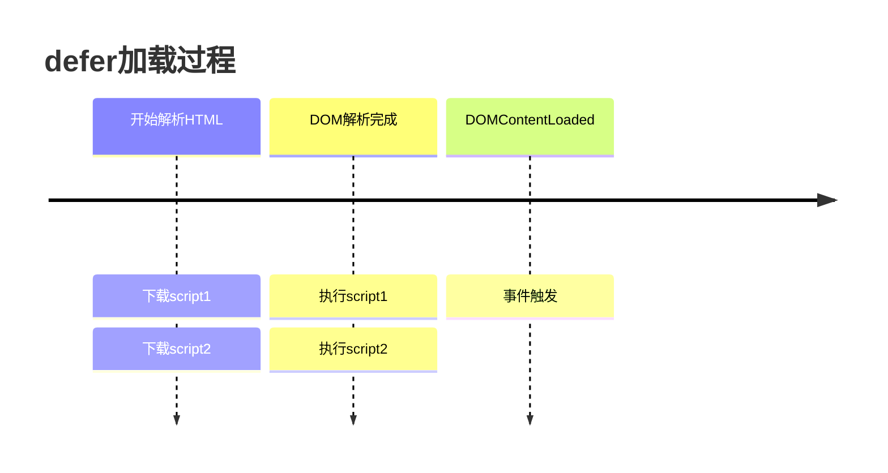
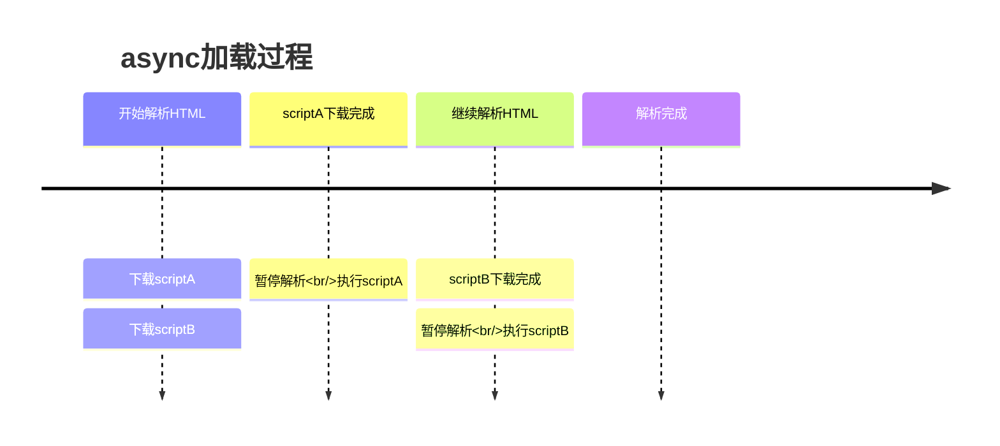
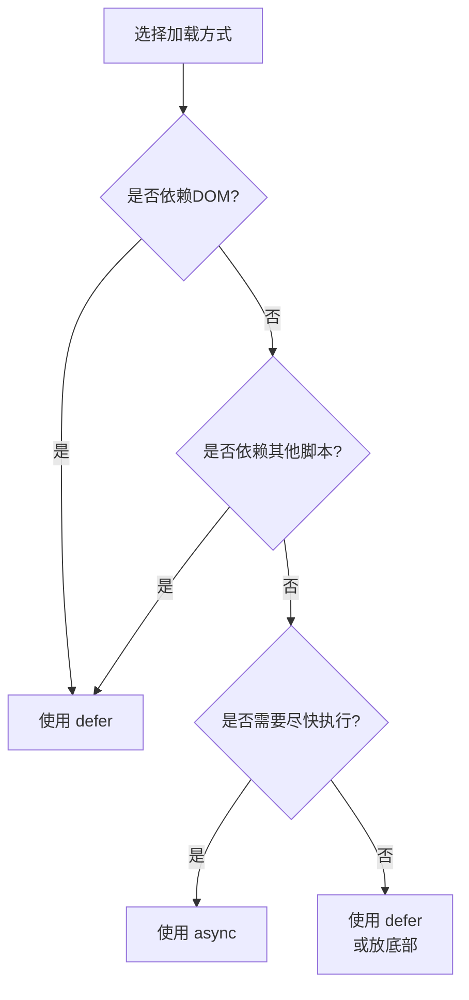

# HTML特殊属性

> [!abstract] 本章重点
> 深入理解HTML中一些重要但容易混淆的属性，特别是 `src` vs `href`、`defer` vs `async` 等面试常考点。

## src vs href

> [!question] 面试常考题
> src和href有什么区别？这是前端面试的高频问题。

### src 属性

**用于替换当前元素内容的资源地址**

```html
<!-- 图片 -->


<!-- 脚本 -->
<script src="app.js"></script>

<!-- 视频 -->
<video src="video.mp4"></video>

<!-- 框架 -->
<iframe src="page.html"></iframe>
```

**src的特点：**

| 特性 | 说明 |
|------|------|
| 行为 | **替换当前元素的内容** |
| 阻塞 | 会暂停其他资源的下载和处理 |
| 加载时机 | 浏览器解析到时立即加载 |
| 应用元素 | img, script, video, audio, iframe, input[type="image"] |

> [!warning] 阻塞渲染
> 当浏览器解析到 `src` 时，会暂停其他资源的下载和处理，直到该资源加载或执行完毕。这可能导致页面渲染阻塞。

### href 属性

**用于建立当前文档与引用资源的联系**

```html
<!-- 超链接 -->
<a href="https://example.com">链接</a>

<!-- 样式表 -->
<link rel="stylesheet" href="style.css">

<!-- 网站图标 -->
<link rel="icon" href="favicon.ico">

<!-- 锚点 -->
<a href="#top">回到顶部</a>
```

**href的特点：**

| 特性 | 说明 |
|------|------|
| 行为 | **建立文档与资源的关联** |
| 阻塞 | 不会阻塞页面解析 |
| 加载时机 | 用户触发（点击）或并行下载（CSS） |
| 应用元素 | a, link, area |

### 对比总结

| 对比项 | src | href |
|--------|-----|------|
| **作用** | 替换元素内容 | 建立文档关联 |
| **加载时机** | 立即加载 | 按需加载 |
| **阻塞性** | **阻塞页面解析** | 不阻塞 |
| **结果** | 将资源嵌入文档 | 指向外部资源 |



## defer vs async

> [!question] 面试常考题
> script标签的defer和async有什么区别？加载顺序是怎样的？

### 默认行为（无defer/async）

```html
<script src="app.js"></script>
```

- 浏览器遇到script立即下载并执行
- **阻塞HTML解析**
- 保证脚本按出现顺序执行

### defer 属性

```html
<script src="app.js" defer></script>
```

**特点：**

| 特性 | 说明 |
|------|------|
| 下载时机 | **并行下载**（不阻塞HTML解析） |
| 执行时机 | **DOM解析完成后**，DOMContentLoaded事件前 |
| 执行顺序 | **按文档顺序执行** |
| 适用场景 | 需要在DOM加载完成后执行的脚本 |



> [!tip] 推荐使用场景
> - 需要操作DOM的脚本
- 依赖其他脚本的脚本
- 大多数业务逻辑代码

### async 属性

```html
<script src="analytics.js" async></script>
```

**特点：**

| 特性 | 说明 |
|------|------|
| 下载时机 | **并行下载**（不阻塞HTML解析） |
| 执行时机 | **下载完成后立即执行**（可能阻塞HTML解析） |
| 执行顺序 | **不保证顺序**（谁先下载完谁先执行） |
| 适用场景 | 独立的、不依赖其他脚本的脚本 |



> [!warning] 注意
> async脚本可能在DOMContentLoaded之前或之后执行，取决于下载速度。

### 三者对比

| 特性 | 默认 | defer | async |
|------|------|-------|-------|
| 下载是否阻塞 | ✅ 阻塞 | ❌ 不阻塞 | ❌ 不阻塞 |
| 执行是否阻塞 | ✅ 阻塞 | ⚠️ DOM完成后 | ✅ 立即执行 |
| 执行顺序 | ✅ 按顺序 | ✅ 按顺序 | ❌ 乱序 |
| DOMContentLoaded | 之后 | 之前 | 不确定 |



### 最佳实践

```html
<!DOCTYPE html>
<html>
<head>
    <!-- 关键的CSS -->
    <link rel="stylesheet" href="critical.css">
    
    <!-- 需要操作DOM的脚本 - 使用defer -->
    <script src="app.js" defer></script>
    <script src="components.js" defer></script>
</head>
<body>
    <!-- 页面内容 -->
    
    <!-- 独立的第三方脚本 - 使用async -->
    <script src="analytics.js" async></script>
    
    <!-- 或传统方式：放在body底部 -->
    <script src="legacy.js"></script>
</body>
</html>
```

## label的for属性

```html
<!-- 显式关联：推荐 -->
<label for="username">用户名：</label>
<input type="text" id="username" name="username">

<!-- 隐式关联 -->
<label>
    密码：
    <input type="password" name="password">
</label>
```

**for属性的作用：**
- `for` 属性值与关联控件的 `id` 属性值一致
- 点击label时，关联的表单控件会获得焦点
- **提升用户体验和可访问性**

## 锚点链接

### 定义锚点

```html
<!-- 方式1：使用name属性（HTML5已废弃） -->
<a name="section1"></a>

<!-- 方式2：使用id属性（推荐） -->
<a id="section1"></a>
<!-- 或任何元素 -->
<h2 id="section1">第一节</h2>
```

### 跳转到锚点

```html
<!-- 同一页面内跳转 -->
<a href="#section1">跳转到第一节</a>

<!-- 跳转到其他页面的锚点 -->
<a href="article.html#section1">查看文章第一节</a>

<!-- 浏览器地址栏直接访问 -->
<!-- https://example.com/page.html#section1 -->
```

### target属性的所有值

| 值 | 说明 |
|----|------|
| `_self` | 默认，当前窗口/框架 |
| `_blank` | 新窗口/标签页 |
| `_parent` | 父框架 |
| `_top` | 顶层窗口 |
| `framename` | 指定名称的框架/iframe |

```html
<!-- 在指定iframe中打开 -->
<iframe name="contentFrame" src="default.html"></iframe>
<a href="page.html" target="contentFrame">在iframe中打开</a>
```

## 置换元素 vs 非置换元素

### 置换元素（Replaced Element）

> [!info] 定义
> 浏览器根据元素的标签和属性，来决定元素的具体显示内容。

**特点：**
- 内容不由元素本身决定
- 浏览器根据属性加载外部资源
- **可以设置宽高**（虽然是行内元素）

**常见置换元素：**
```html
        <!-- 根据src显示图片 -->
<input>      <!-- 根据type显示不同控件 -->
<textarea>   <!-- 文本输入区域 -->
<select>     <!-- 下拉选择 -->
<iframe>     <!-- 内嵌框架 -->
<video>      <!-- 视频 -->
<audio>      <!-- 音频 -->
<canvas>     <!-- 画布 -->
<object>     <!-- 嵌入对象 -->
```

### 非置换元素

> [!info] 定义
> 内容直接表现给用户端，显示内容就是元素内部的内容。

**特点：**
- 内容由元素内部的文本/HTML决定
- 大多数HTML元素都是非置换元素

**示例：**
```html
<p>这段文字就是p元素的内容</p>
<span>这是span的内容</span>
<div>div内部的内容直接显示</div>
```

### 对比

| 特性 | 置换元素 | 非置换元素 |
|------|----------|------------|
| 内容来源 | 外部资源 | 元素内部 |
| 宽高设置 | ✅ 可以设置 | 行内元素：❌ |
| CSS盒模型 | 特殊 | 标准 |
| 示例 | img, input, iframe | p, div, span |

## 面试题汇总

> [!faq] Q: src和href有什么区别？
> **答：** src用于替换当前元素内容，会阻塞页面解析；href用于建立文档与资源的关联，不会阻塞解析。

> [!faq] Q: defer和async的区别？
> **答：** 两者都是异步下载不阻塞解析。但defer在DOM解析后按顺序执行，async下载完立即执行且不保证顺序。

> [!faq] Q: 为什么img标签可以设置宽高？
> **答：** 因为img是置换元素，浏览器根据src属性加载外部资源，置换元素可以设置宽高。

---
*相关链接：[[00-HTML-MOC|返回知识地图]] | [[05-HTML5新特性|下一步：HTML5新特性]]*