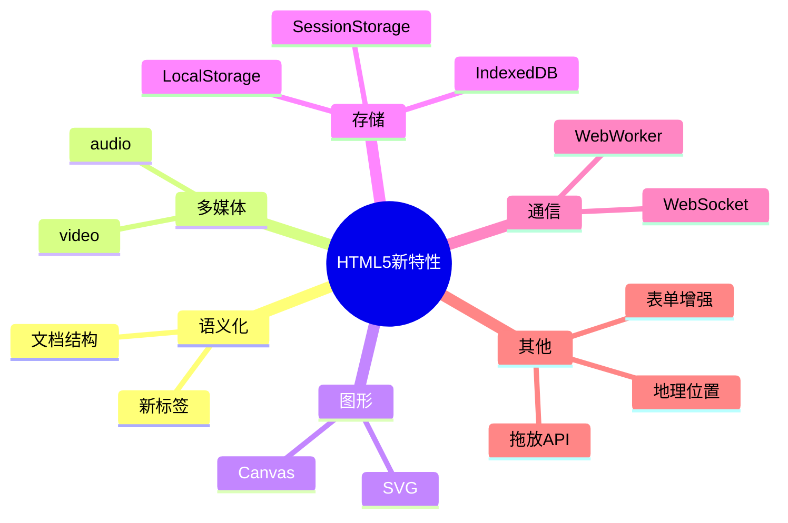
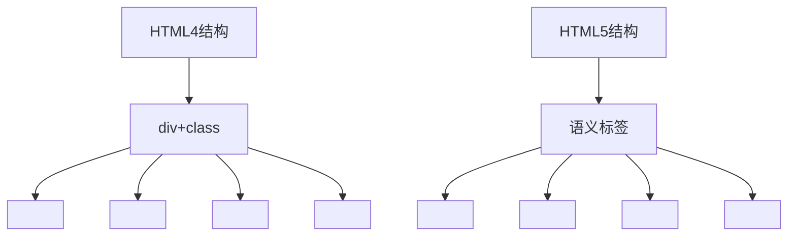
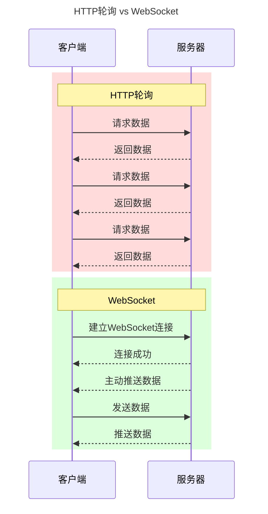

# HTML5新特性

> [!abstract] HTML5概览
> HTML5 在 2008 年发布草案，2014 年正式成为 W3C 推荐标准。它不仅是HTML4.01的升级，更是一个完整的Web应用开发平台。



## 一、文档声明

### HTML5文档结构

```html
<!DOCTYPE html>                    <!-- 简化的文档声明 -->
<html lang="zh-CN">                <!-- 语言属性 -->
<head>
    <meta charset="UTF-8">         <!-- 字符编码 -->
    <meta name="viewport"           <!-- 视口设置 -->
          content="width=device-width, initial-scale=1.0">
    <title>Document</title>
</head>
<body>
    <!-- 页面内容 -->
</body>
</html>
```

> [!tip] 与HTML4的区别
> - `<!DOCTYPE html>` - 简化的文档声明
> - `<meta charset="UTF-8">` - 简化的字符编码声明
> - 不再需要DTD（文档类型定义）

## 二、语义化标签

### 新语义标签

```html
<body>
    <header>                       <!-- 页头 -->
        <nav>导航链接</nav>         <!-- 导航 -->
    </header>
    
    <main>                         <!-- 主要内容 -->
        <article>                  <!-- 独立文章 -->
            <header>文章标题</header>
            <section>章节1</section> <!-- 章节 -->
            <section>章节2</section>
            <footer>文章底部</footer>
        </article>
        
        <aside>侧边栏内容</aside>    <!-- 侧边栏 -->
    </main>
    
    <footer>页脚</footer>           <!-- 页脚 -->
</body>
```

### 语义化标签对比



### 语义化优势

| 优势 | 说明 |
|------|------|
| **SEO** | 搜索引擎更好地理解页面结构 |
| **可访问性** | 屏幕阅读器更易解析 |
| **代码可读性** | 代码结构更清晰 |
| **维护性** | 减少class使用，更易维护 |

## 三、表单增强

### 新的input类型

| 类型 | 用途 | 特性 |
|------|------|------|
| `email` | 邮箱输入 | 自动验证邮箱格式 |
| `url` | URL输入 | 自动验证URL格式 |
| `number` | 数字输入 | min, max, step属性 |
| `range` | 范围滑块 | 滑动选择数值 |
| `date` | 日期选择 | 日期选择器 |
| `time` | 时间选择 | 时间选择器 |
| `datetime-local` | 日期时间 | 本地日期时间 |
| `month` | 月份选择 | 年月选择 |
| `week` | 周选择 | 年周选择 |
| `color` | 颜色选择 | 颜色拾取器 |
| `search` | 搜索框 | 带清除按钮 |
| `tel` | 电话输入 | 移动端显示数字键盘 |

```html
<form>
    <!-- 邮箱输入 -->
    <label>邮箱：</label>
    <input type="email" placeholder="your@email.com" required>
    
    <!-- 数字输入 -->
    <label>数量：</label>
    <input type="number" min="1" max="100" step="1" value="1">
    
    <!-- 范围滑块 -->
    <label>音量：</label>
    <input type="range" min="0" max="100" value="50">
    
    <!-- 日期选择 -->
    <label>生日：</label>
    <input type="date" min="1900-01-01" max="2024-12-31">
    
    <!-- 颜色选择 -->
    <label>主题色：</label>
    <input type="color" value="#4285f4">
</form>
```

### 新的表单属性

```html
<input type="text"
       placeholder="请输入内容"     <!-- 占位提示 -->
       required                    <!-- 必填 -->
       autofocus                   <!-- 自动聚焦 -->
       autocomplete="off"          <!-- 关闭自动完成 -->
       pattern="[A-Za-z]{3}"       <!-- 正则验证 -->
       minlength="3"               <!-- 最小长度 -->
       maxlength="10">             <!-- 最大长度 -->
```

### 兼容性处理

> [!warning] 注意
> 如果浏览器不支持新type，会退化为text类型

```html
<!-- 降级处理示例 -->
<input type="date" placeholder="选择日期">
<!-- 旧浏览器显示为普通文本框，placeholder仍然有效 -->
```

## 四、多媒体

### 视频标签

```html
<video controls
       width="640"
       height="360"
       poster="封面图.jpg"
       preload="auto">
    <source src="video.mp4" type="video/mp4">
    <source src="video.webm" type="video/webm">
    <source src="video.ogg" type="video/ogg">
    您的浏览器不支持视频播放
</video>
```

**属性说明：**

| 属性 | 说明 |
|------|------|
| `controls` | 显示播放控件 |
| `autoplay` | 自动播放 |
| `loop` | 循环播放 |
| `muted` | 静音 |
| `poster` | 封面图片 |
| `preload` | 预加载策略(none/metadata/auto) |

**支持格式：** MP4(H.264), WebM, Ogg

### 音频标签

```html
<audio controls loop>
    <source src="audio.mp3" type="audio/mpeg">
    <source src="audio.ogg" type="audio/ogg">
    您的浏览器不支持音频播放
</audio>
```

**支持格式：** MP3, Ogg Vorbis, Wav

## 五、Canvas画布

> [!info] Canvas
> HTML5的 `<canvas>` 元素可以通过JavaScript动态绘制图形、动画、游戏等。

```html
<canvas id="myCanvas" width="500" height="300">
    您的浏览器不支持Canvas
</canvas>

<script>
    const canvas = document.getElementById('myCanvas');
    const ctx = canvas.getContext('2d');
    
    // 绘制矩形
    ctx.fillStyle = '#FF0000';
    ctx.fillRect(10, 10, 100, 100);
    
    // 绘制圆形
    ctx.beginPath();
    ctx.arc(200, 75, 50, 0, 2 * Math.PI);
    ctx.stroke();
</script>
```

**Canvas应用场景：**
- 数据可视化（图表）
- 游戏开发
- 图像处理
- 动画效果

> [!tip] 实战案例
> 查看 [[06-Canvas实战案例|Canvas画板实战]] 获取完整示例

## 六、Web存储

### LocalStorage

> [!note] 特点
> - 永久存储（除非手动删除）
> - 存储容量约 5-10MB
> - 只能存储字符串

```javascript
// 存储数据
localStorage.setItem('username', '张三');
localStorage.setItem('age', '25');

// 读取数据
const username = localStorage.getItem('username');

// 删除数据
localStorage.removeItem('username');

// 清空所有
localStorage.clear();
```

### SessionStorage

> [!note] 特点
> - 会话级存储（关闭标签页即删除）
- 存储容量约 5-10MB

```javascript
// 使用方式与localStorage相同
sessionStorage.setItem('token', 'abc123');
const token = sessionStorage.getItem('token');
```

### 存储对比

| 特性 | Cookie | LocalStorage | SessionStorage |
|------|--------|--------------|----------------|
| 生命周期 | 可设置 | 永久 | 会话级 |
| 存储容量 | ~4KB | ~5-10MB | ~5-10MB |
| 服务端读取 | ✅ | ❌ | ❌ |
| 每次请求携带 | ✅ | ❌ | ❌ |

## 七、WebSocket

> [!info] 实时通信
> WebSocket 提供了在单个 TCP 连接上进行**全双工通信**的能力。

```javascript
// 建立WebSocket连接
const ws = new WebSocket('wss://example.com/socket');

// 连接建立时
ws.onopen = function() {
    console.log('连接已建立');
    ws.send('Hello Server!');
};

// 接收消息时
ws.onmessage = function(event) {
    console.log('收到消息：', event.data);
};

// 连接关闭时
ws.onclose = function() {
    console.log('连接已关闭');
};

// 发生错误时
ws.onerror = function(error) {
    console.error('WebSocket错误：', error);
};
```

**WebSocket vs HTTP轮询：**



**应用场景：**
- 实时聊天
- 在线游戏
- 股票行情
- 协同编辑

## 八、WebWorker

> [!info] 多线程
> WebWorker 允许在后台线程中运行JavaScript，不阻塞主线程。

```javascript
// main.js - 主线程
const worker = new Worker('worker.js');

// 发送消息给Worker
worker.postMessage({cmd: 'calculate', data: [1, 2, 3, 4, 5]});

// 接收Worker消息
worker.onmessage = function(event) {
    console.log('计算结果：', event.data);
};

// 终止Worker
worker.terminate();
```

```javascript
// worker.js - Worker线程
self.onmessage = function(event) {
    const {cmd, data} = event.data;
    
    if (cmd === 'calculate') {
        // 执行耗时计算
        const result = data.reduce((a, b) => a + b, 0);
        
        // 返回结果
        self.postMessage(result);
    }
};
```

**Worker限制：**
- ❌ 不能访问DOM
- ❌ 不能使用window对象
- ✅ 可以使用XMLHttpRequest/fetch
- ✅ 可以使用setTimeout/setInterval

## 九、地理位置

```javascript
// 获取当前位置
navigator.geolocation.getCurrentPosition(
    function(position) {
        console.log('纬度：', position.coords.latitude);
        console.log('经度：', position.coords.longitude);
        console.log('精度：', position.coords.accuracy);
    },
    function(error) {
        console.error('获取位置失败：', error);
    }
);

// 持续监听位置变化
const watchId = navigator.geolocation.watchPosition(success, error);

// 停止监听
navigator.geolocation.clearWatch(watchId);
```

## 十、HTML5兼容性

```html
<!-- 条件注释（仅IE） -->
<!--[if lt IE 9]>
    <script src="html5shiv.js"></script>
<![endif]-->
```

> [!tip] 现代浏览器
> 目前主流浏览器都已完整支持HTML5，除非需要兼容IE8及以下，否则无需额外处理。

---
*相关链接：[[00-HTML-MOC|返回知识地图]] | [[06-Canvas实战案例|下一步：Canvas实战]]*