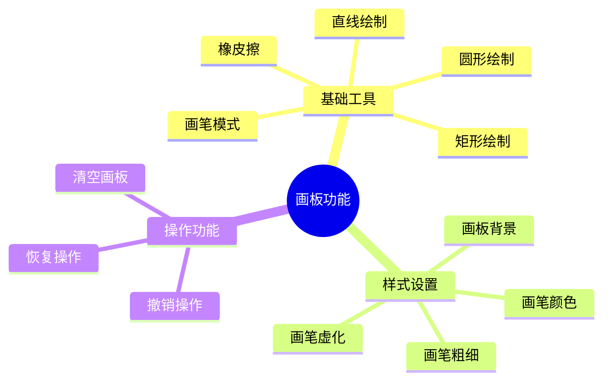
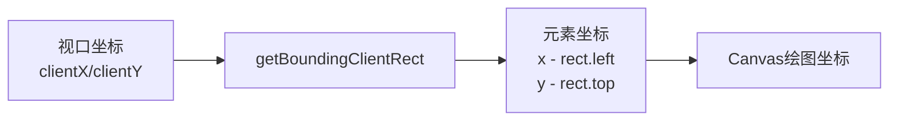
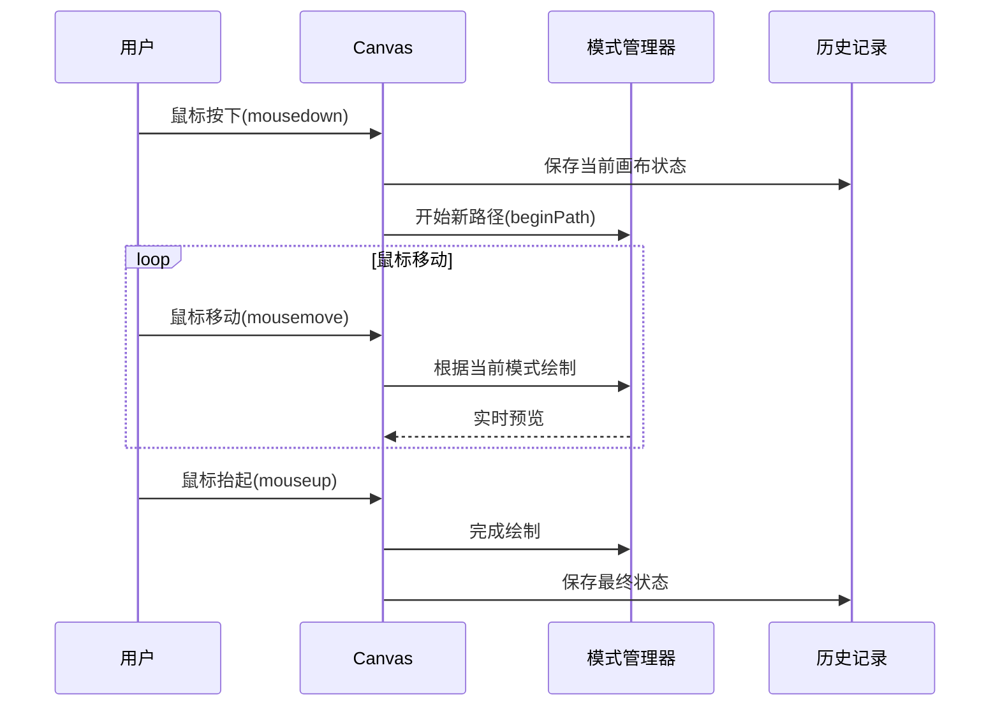

# Canvas实战案例：原生JS画板

> [!abstract] 项目简介
> 使用HTML5 Canvas + 原生JavaScript实现功能完善的画板应用，支持画笔、直线、矩形、圆形、橡皮擦等工具。


## 功能特性



### 核心功能

- ✅ **画笔模式** - 自由绘制线条
- ✅ **直线工具** - 绘制直线
- ✅ **矩形工具** - 绘制矩形
- ✅ **圆形工具** - 绘制圆形
- ✅ **橡皮擦** - 擦除绘制内容
- ✅ **样式调整** - 颜色、粗细、虚化效果
- ✅ **撤销/恢复** - 支持20步操作历史
- ✅ **清空画板** - 一键清空

## 完整代码

> [!note] 完整实现
> 以下是包含HTML、CSS、JavaScript的完整代码：

```html
<!DOCTYPE html>
<html lang="zh-CN">
<head>
    <meta charset="UTF-8">
    <meta name="viewport" content="width=device-width, initial-scale=1.0">
    <title>Canvas画板</title>
    <style>
        * {
            border: 0;
            margin: 0;
            user-select: none;
        }

        html:root {
            font-size: 16px;
        }

        #draw {
            position: relative;
            font-size: .625rem;
            width: 50rem;
            height: 25rem;
            background-color: rgb(82, 231, 12);
        }

        #tools {
            text-align: center;
            position: absolute;
            width: 6.25rem;
            height: 100%;
        }

        #header {
            background-color: rgb(55, 205, 224);
            height: 52%;
        }

        #footer {
            position: absolute;
            display: flex;
            align-items: center;
            justify-content: center;
            flex-direction: column;
            flex-wrap: wrap;
            top: 15.625rem;
            width: 6.25rem;
            height: 35%;
            background-color: rgb(184, 72, 20);
        }

        .btn {
            margin: .3rem;
            box-shadow: 0 0 3px 1px inset;
            cursor: pointer;
        }

        #canvas {
            position: relative;
            margin-left: 6.25rem;
            box-shadow: 0 0 5px 5px inset;
        }

        input {
            margin: .3125rem;
        }

        .colors {
            width: 40%;
            height: 1.25rem;
        }

        .ranges {
            width: 90%;
        }

        .selected {
            background-color: rgb(166, 255, 0);
        }

        #clear:active,
        #back:active,
        #restore:active {
            background-color: rgb(166, 255, 0);
        }
    </style>
</head>
<body>
    <div id="draw">
        <div id="tools">
            <h2>工具栏</h2>
            <div id="header">
                <input id="color" type="color" class="colors" value="#000000">
                <label>画笔颜色</label>
                <input id="bgc" type="color" class="colors" value="#ffffff">
                <label>画板颜色</label>
                <input id="lineWidthSmall" class="ranges" type="range" 
                       value="0.01" min="0.002" max="0.02" step="0.001">
                <label>画笔微调~<span id="text1"></span></label>
                <input id="lineWidthBig" class="ranges" type="range" 
                       value="2" min="0" max="10" step="0.01">
                <label>画笔粗调~<span id="text2"></span></label>
                <input id="shadowBlur" class="ranges" type="range" 
                       value="1" min="0" max="10" step="0.01">
                <label>画笔虚化~<span id="text3"></span></label>
            </div>
            <div id="footer">
                <button id="pen" class="btn selected">画笔</button>
                <button id="line" class="btn">直线</button>
                <button id="rect" class="btn">矩形</button>
                <button id="cir" class="btn">圆形</button>
                <button id="eraser" class="btn">橡皮</button>
                <button id="clear" class="btn">清空</button>
                <button id="back" class="btn">撤销</button>
                <button id="restore" class="btn">恢复</button>
            </div>
        </div>
        <canvas id="canvas" width="700" height="400"></canvas>
    </div>

    <script>
        // ==================== 获取DOM元素 ====================
        const canvas = document.querySelector('#canvas');
        const ctx = canvas.getContext('2d');
        
        // 工具栏元素
        const btnColor = document.querySelector('#color');
        const btnBgc = document.querySelector('#bgc');
        const lineWidthSmall = document.querySelector('#lineWidthSmall');
        const lineWidthSmallSpan = document.querySelector('#text1');
        const lineWidthBig = document.querySelector('#lineWidthBig');
        const lineWidthBigSpan = document.querySelector('#text2');
        const shadowBlur = document.querySelector('#shadowBlur');
        const shadowBlurSpan = document.querySelector('#text3');
        
        // 模式按钮
        const btnPen = document.querySelector('#pen');
        const btnLine = document.querySelector('#line');
        const btnRect = document.querySelector('#rect');
        const btnCir = document.querySelector('#cir');
        const btnEraser = document.querySelector('#eraser');
        const btnClear = document.querySelector('#clear');
        const btnBack = document.querySelector('#back');
        const btnRestore = document.querySelector('#restore');

        // ==================== 全局变量 ====================
        let isPressDown = false;
        let curMode = 'penMode';
        let pressPos = null;
        let curPos = null;
        let startData = null;

        // ==================== 工具函数 ====================
        
        /**
         * 获取鼠标相对于画布的坐标
         */
        const getMousePos = function(clientX, clientY) {
            const rect = canvas.getBoundingClientRect();
            return {
                x: clientX - rect.left,
                y: clientY - rect.top
            };
        };

        /**
         * 高亮选中按钮
         */
        const selected = function(ele) {
            const buttons = document.querySelectorAll('.btn');
            buttons.forEach(btn => btn.className = 'btn');
            ele.className = 'btn selected';
        };

        // ==================== 图像历史记录管理 ====================
        const backOrRestore = (function() {
            const imageOperate = {
                imageDataArray: [],  // 图像历史数组
                curImageIndex: -1    // 当前图像索引
            };

            imageOperate.save = function(data) {
                if (this.imageDataArray.length >= 20) {
                    this.imageDataArray.shift();
                }
                this.imageDataArray.push(data);
                this.curImageIndex = this.imageDataArray.length - 1;
            };

            imageOperate.back = function() {
                this.curImageIndex--;
                if (this.curImageIndex <= 0) {
                    this.curImageIndex = 0;
                }
                paint('drawMode', this.imageDataArray[this.curImageIndex]);
            };

            imageOperate.restore = function() {
                this.curImageIndex++;
                if (this.curImageIndex >= this.imageDataArray.length) {
                    this.curImageIndex = this.imageDataArray.length - 1;
                }
                paint('drawMode', this.imageDataArray[this.curImageIndex]);
            };

            imageOperate.clear = function() {
                this.imageDataArray.length = 0;
                this.curImageIndex = -1;
            };

            return function(operate, imageData) {
                imageOperate[operate](imageData);
            };
        })();

        // ==================== 绘制模式 ====================
        const paint = (function() {
            const Mode = {};

            // 画笔模式
            Mode.penMode = function() {
                ctx.lineTo(curPos.x, curPos.y);
                ctx.stroke();
            };

            // 直线模式
            Mode.lineMode = function() {
                ctx.moveTo(pressPos.x, pressPos.y);
                ctx.lineTo(curPos.x, curPos.y);
                ctx.stroke();
            };

            // 矩形模式
            Mode.rectMode = function() {
                ctx.rect(
                    pressPos.x, 
                    pressPos.y, 
                    curPos.x - pressPos.x, 
                    curPos.y - pressPos.y
                );
                ctx.stroke();
            };

            // 圆形模式
            Mode.cirMode = function() {
                const cx = (curPos.x + pressPos.x) / 2;
                const cy = (curPos.y + pressPos.y) / 2;
                const dx = Math.abs(curPos.x - pressPos.x);
                const dy = Math.abs(curPos.y - pressPos.y);
                const r = Math.sqrt(Math.pow(dx, 2) + Math.pow(dy, 2)) / 2;
                
                ctx.arc(cx, cy, r, 0, 2 * Math.PI);
                ctx.stroke();
            };

            // 橡皮模式
            Mode.eraserMode = function() {
                ctx.save();
                ctx.beginPath();
                ctx.arc(
                    curPos.x, 
                    curPos.y, 
                    lineWidthSmall.value * 1 + lineWidthBig.value * 1, 
                    0, 
                    2 * Math.PI
                );
                ctx.clip();
                ctx.clearRect(0, 0, canvas.width, canvas.height);
                ctx.restore();
            };

            // 重绘历史图像
            Mode.drawMode = function(data = new ImageData(canvas.width, canvas.height)) {
                ctx.clearRect(0, 0, canvas.width, canvas.height);
                ctx.putImageData(data, 0, 0);
                ctx.beginPath();
            };

            return function(mode = curMode, data = undefined) {
                Mode[mode](data);
            };
        })();

        // ==================== 绘制控制 ====================
        const draw = function(state) {
            switch (state) {
                case 'down':
                    // 鼠标按下
                    break;
                case 'move':
                    // 绘制实时辅助线（直线、矩形、圆形）
                    if (['rectMode', 'cirMode', 'lineMode'].includes(curMode)) {
                        paint('drawMode', startData);
                    }
                    paint();
                    break;
                case 'up':
                    // 鼠标抬起时绘制（直线、矩形、圆形）
                    if (['lineMode', 'rectMode', 'cirMode'].includes(curMode)) {
                        paint();
                    }
                    break;
            }
        };

        // ==================== 初始化 ====================
        const init = function() {
            // 初始化画笔样式
            ctx.strokeStyle = btnColor.value;
            ctx.shadowColor = btnColor.value;
            ctx.lineWidth = lineWidthSmall.value * 1 + lineWidthBig.value * 1;
            ctx.shadowBlur = shadowBlur.value;
            canvas.style.backgroundColor = '#ffffff';
            
            // 显示初始值
            lineWidthSmallSpan.innerHTML = lineWidthSmall.value;
            lineWidthBigSpan.innerHTML = lineWidthBig.value;
            shadowBlurSpan.innerHTML = shadowBlur.value;
            
            // 保存初始空白画布
            backOrRestore('save', ctx.getImageData(0, 0, canvas.width, canvas.height));
        };

        // ==================== 事件绑定 ====================
        
        // 画笔设置
        btnColor.onchange = function() {
            ctx.shadowColor = this.value;
            ctx.strokeStyle = this.value;
        };

        btnBgc.onchange = function() {
            canvas.style.backgroundColor = this.value;
        };

        lineWidthSmall.onchange = function() {
            ctx.lineWidth = this.value * 1 + lineWidthBig.value * 1;
            lineWidthSmallSpan.innerHTML = this.value;
        };

        lineWidthBig.onchange = function() {
            ctx.lineWidth = lineWidthSmall.value * 1 + this.value * 1;
            lineWidthBigSpan.innerHTML = this.value;
        };

        shadowBlur.onchange = function() {
            ctx.shadowBlur = this.value * 1;
            shadowBlurSpan.innerHTML = this.value;
        };

        // 模式切换
        btnPen.onclick = function() {
            selected(this);
            curMode = 'penMode';
        };

        btnLine.onclick = function() {
            selected(this);
            curMode = 'lineMode';
        };

        btnRect.onclick = function() {
            selected(this);
            curMode = 'rectMode';
        };

        btnCir.onclick = function() {
            selected(this);
            curMode = 'cirMode';
        };

        btnEraser.onclick = function() {
            selected(this);
            curMode = 'eraserMode';
        };

        // 操作按钮
        btnClear.onclick = function() {
            ctx.clearRect(0, 0, canvas.width, canvas.height);
            backOrRestore('clear');
            backOrRestore('save', ctx.getImageData(0, 0, canvas.width, canvas.height));
        };

        btnBack.onclick = function() {
            backOrRestore('back');
        };

        btnRestore.onclick = function() {
            backOrRestore('restore');
        };

        // 画布事件
        canvas.onmousedown = function(e) {
            pressPos = curPos = getMousePos(e.clientX, e.clientY);
            startData = ctx.getImageData(0, 0, canvas.width, canvas.height);
            isPressDown = true;
            ctx.beginPath();
            draw('down');
        };

        canvas.onmousemove = function(e) {
            if (isPressDown) {
                curPos = getMousePos(e.clientX, e.clientY);
                draw('move');
            }
        };

        canvas.onmouseup = function(e) {
            curPos = getMousePos(e.clientX, e.clientY);
            isPressDown = false;
            draw('up');
            ctx.save();
            backOrRestore('save', ctx.getImageData(0, 0, canvas.width, canvas.height));
        };

        // 启动
        init();
    </script>
</body>
</html>
```

## 核心原理解析

### 1. Canvas坐标系统



### 2. 绘制流程



### 3. 历史记录实现

> [!info] 撤销/恢复原理
> 使用 `getImageData()` 保存画布像素数据，`putImageData()` 恢复历史状态。

```javascript
// 保存画布状态
const imageData = ctx.getImageData(0, 0, canvas.width, canvas.height);
history.push(imageData);

// 恢复画布状态
ctx.putImageData(history[index], 0, 0);
```

## 拓展方向

> [!todo] 可以添加的功能
> - [ ] 保存Canvas为图片下载
> - [ ] 实现选择/框选功能
> - [ ] 添加旋转功能
> - [ ] 画板缩放、自定义大小
> - [ ] 文本输入功能
> - [ ] 图层管理
> - [ ] 多种画笔样式
> - [ ] 图形填充
> - [ ] 快捷键支持

## 相关资源

- [[05-HTML5新特性|HTML5 Canvas介绍]]
- [MDN Canvas教程](https://developer.mozilla.org/zh-CN/docs/Web/API/Canvas_API/Tutorial)
- [Canvas API文档](https://developer.mozilla.org/zh-CN/docs/Web/API/CanvasRenderingContext2D)

---
*相关链接：[[00-HTML-MOC|返回知识地图]] | [[01-HTML基础入门|返回基础入门]]*