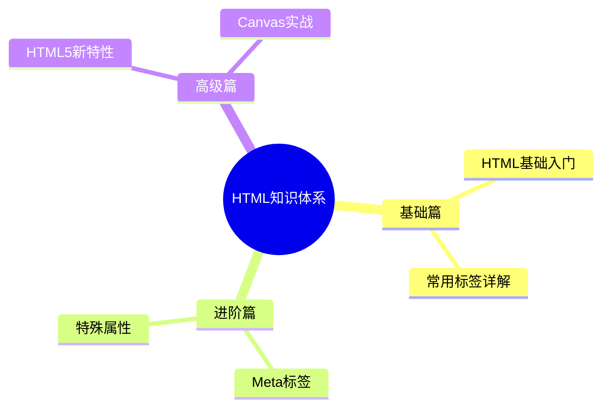

# HTML系列笔记

> [!abstract] 简介
> 本系列笔记涵盖HTML超文本标记语言的基础知识到高级特性，包括HTML5新功能及实战案例。

## 你能学到什么

- ✅ HTML基础语法与结构
- ✅ 常用标签及其属性详解
- ✅ Meta标签与SEO优化
- ✅ 特殊属性的深入理解（src vs href, defer vs async）
- ✅ HTML5新特性（语义化、多媒体、Canvas）
- ✅ 实战项目：Canvas画板

## 快速导航

> [!tip] 建议按照以下顺序学习

| 序号 | 文档 | 内容 | 预计时间 |
|------|------|------|----------|
| 00 | [[00-HTML-MOC|📚 HTML知识地图]] | 完整学习路线图 | 5分钟 |
| 01 | [[01-HTML基础入门|🌱 HTML基础入门]] | 基础概念与语法 | 30分钟 |
| 02 | [[02-HTML标签详解|🏷️ HTML标签详解]] | 常用标签大全 | 60分钟 |
| 03 | [[03-Meta标签详解|🔍 Meta标签详解]] | 元信息与SEO | 30分钟 |
| 04 | [[04-HTML特殊属性|⚡ HTML特殊属性]] | 进阶属性解析 | 30分钟 |
| 05 | [[05-HTML5新特性|🚀 HTML5新特性]] | 现代Web开发 | 60分钟 |
| 06 | [[06-Canvas实战案例|🎨 Canvas实战]] | 动手实践 | 90分钟 |

## 知识架构

## 学习建议

> [!tip] 高效学习方法
> 1. **按顺序学习**：从基础到实战，循序渐进
> 2. **动手实践**：每学完一个章节，尝试写代码
> 3. **建立联系**：使用双链跳转到相关知识点
> 4. **定期复习**：利用知识地图回顾所学内容

## 相关资源

- [MDN HTML文档](https://developer.mozilla.org/zh-CN/docs/Web/HTML)
- [HTML5规范](https://html.spec.whatwg.org/)
- [Can I Use](https://caniuse.com/) - 浏览器兼容性查询

---

> [!success] 开始你的学习之旅
> 从 [[00-HTML-MOC|HTML知识地图]] 开始，系统掌握HTML！

*最后更新：2026-02-10*
