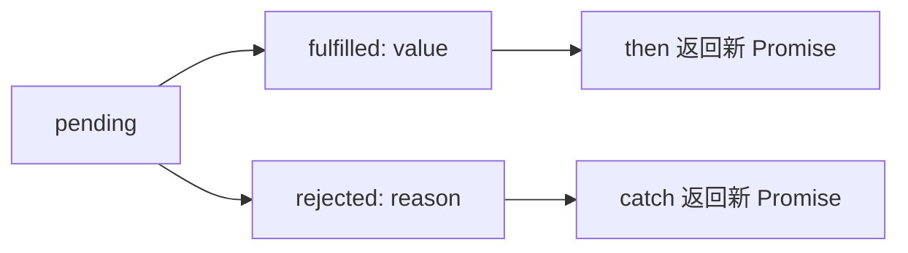

# PromiseResult

## 定义

`PromiseResult` 是理解 Promise 内部结果值时常用的概念，表示 Promise 成功后的值或失败后的拒绝原因。它和 [[PromiseState]] 一起描述 Promise 的状态机。

## 要点

- 当状态为 `fulfilled` 时，结果是 `resolve(value)` 传入的值。
- 当状态为 `rejected` 时，结果是 `reject(reason)` 传入的原因。
- 业务代码不能直接读取内部结果，只能通过 `then`、`catch`、`finally` 或 `await` 获取。
- Promise 链式调用会根据回调返回值生成新的 PromiseResult。

## 示例

`Promise.resolve(1).then(x => x + 1)` 中，第一个 Promise 的结果是 `1`，后续 Promise 的结果是 `2`。

## 状态流转

## 检查清单

- 是否区分 Promise 状态和结果值。
- then/catch 回调返回普通值、Promise、抛错时，新 PromiseResult 如何变化。
- async 函数返回值是否会被包装成 Promise。
- await 捕获的是 fulfilled value 还是 rejected reason。
- 是否避免直接依赖浏览器 DevTools 中的内部字段名。

## 相关概念

- [[PromiseState]]
- [[异步编程]]
- [[JavaScript]]
