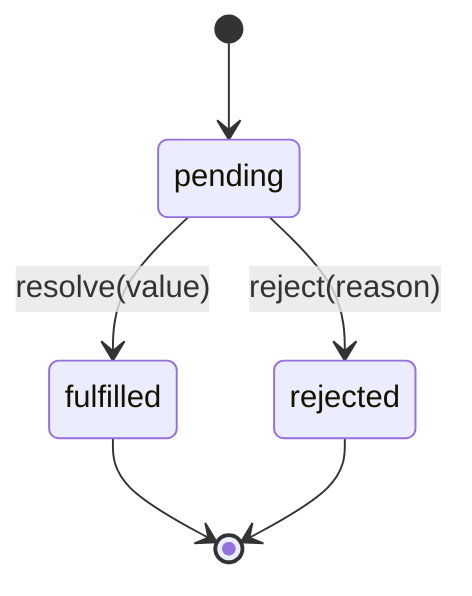

# PromiseState

## 定义

`PromiseState` 是理解 Promise 内部状态机时常用的概念，表示一个 Promise 当前处于 `pending`、`fulfilled` 或 `rejected` 中的哪一种状态。真实 JavaScript 引擎不会把它作为可直接访问的公开属性暴露给业务代码。

## 要点

- `pending`：异步操作尚未完成，结果未确定。
- `fulfilled`：异步操作成功完成，拥有成功值。
- `rejected`：异步操作失败，拥有拒绝原因。
- Promise 状态一旦从 `pending` 变为 `fulfilled` 或 `rejected`，就不可逆。

## 示例

手写 Promise 时通常会用 `state` 字段模拟 `PromiseState`，再根据状态决定回调进入成功队列还是失败队列。

## 状态机



`fulfilled` 和 `rejected` 都是终态，Promise 一旦 settle，就不会再被后续 `resolve` 或 `reject` 改变。

## 案例

```javascript
const p = new Promise((resolve, reject) => {
  resolve("ok");
  reject(new Error("late error"));
});
```

这个 Promise 最终是 `fulfilled`，因为第一次 `resolve` 已经让状态定格，后面的 `reject` 会被忽略。

## 检查清单

- 是否区分状态 `PromiseState` 和结果 `PromiseResult`。
- 是否理解 pending 只能转向 fulfilled 或 rejected 一次。
- 是否避免在 Promise 外部同步读取内部状态。
- 是否用 `.then/.catch/finally` 或 `async/await` 处理状态变化。

## 相关概念

- [[PromiseResult]]
- [[异步编程]]
- [[JavaScript]]
