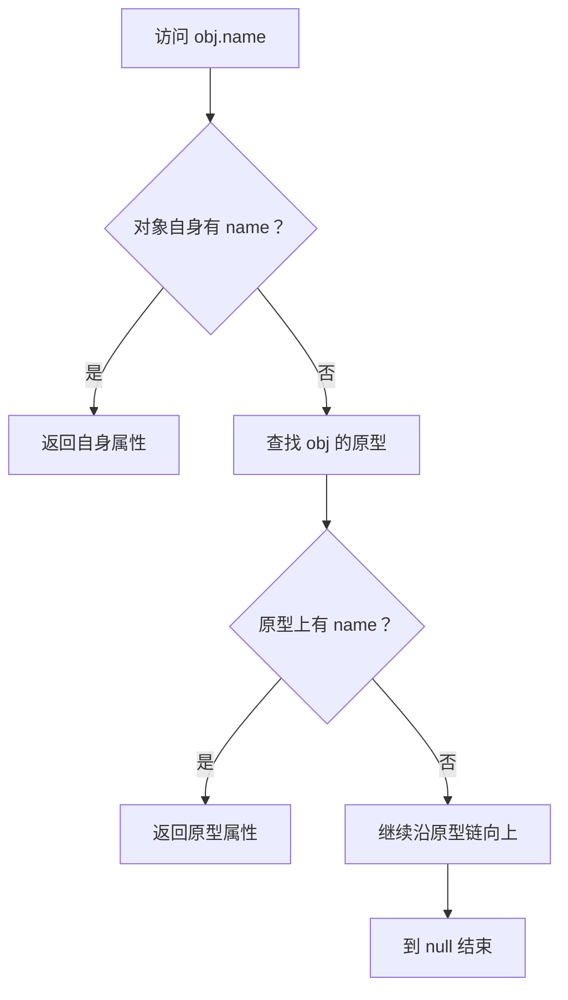

# Prototype

## 定义

Prototype 是 JavaScript 对象继承机制的核心概念。函数对象的 `prototype` 属性用于给通过 `new` 创建的实例提供共享方法，普通对象的内部原型用于沿着原型链查找属性。

## 要点

- `Constructor.prototype` 是实例共享方法和属性的挂载位置。
- 实例对象通过内部原型连接到构造函数的 `prototype`。
- 属性查找会先查对象自身，再沿原型链向上查找。
- `Object.create(proto)` 可以直接创建以 `proto` 为原型的对象。
- 不应随意修改内置对象原型，容易造成全局污染和兼容性问题。

## 示例

`arr.map` 并不是每个数组实例单独拥有的方法，而是来自 `Array.prototype.map`。

## 查找流程



## 案例

```javascript
function User(name) {
  this.name = name;
}

User.prototype.sayHi = function () {
  return `Hi, ${this.name}`;
};

const user = new User("Chen");
user.sayHi();
```

`sayHi` 不在 `user` 自身属性上，而是在 `User.prototype` 上。多个实例共享同一个方法，避免每次创建实例都复制函数。

## 常见误区

- 把 `prototype` 和对象内部原型混为一谈。
- 在运行时随意改内置原型，例如 `Array.prototype`。
- 用原型链存放实例私有数据，导致多个实例互相影响。
- 只记 `__proto__`，不理解属性查找和构造函数之间的关系。

## 检查清单

- 共享方法是否放在原型上，实例私有数据是否放在构造函数内。
- 是否避免修改内置对象原型。
- 是否理解 `class` 语法本质上仍基于原型机制。
- 调试属性来源时是否区分 own property 和 prototype property。

## 相关概念

- [[原型链]]
- [[JavaScript]]
- [[函数式编程]]
