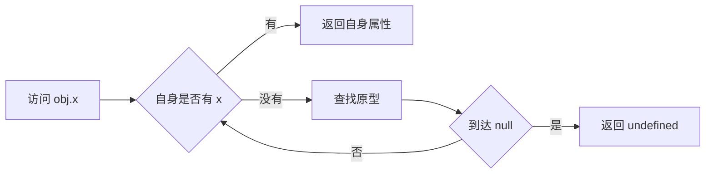

# 原型链

## 定义

原型链是 JavaScript 对象属性查找和继承的机制。当访问对象属性时，引擎先查对象自身，再沿内部原型逐级向上查找，直到 `null`。

## 要点

- 构造函数的 `prototype` 会成为实例的原型。
- `Object.prototype` 通常位于普通对象原型链顶端。
- 原型链过深会增加理解成本，也可能造成属性遮蔽问题。
- class 语法本质上仍建立在原型机制之上。

## 相关概念

- [[Prototype]]
- [[JavaScript]]
- [[设计模式]]

## 查找流程

## 实践检查清单

- 是否区分 `prototype`、`__proto__` 和内部原型。
- 是否使用 `Object.create` 或 class 明确继承关系。
- 枚举属性时是否区分自身属性和继承属性。
- 是否避免修改内置对象原型。
- 调试继承问题时是否查看对象真实原型链。

## 案例

`class User extends Person` 创建的实例查找方法时，会先看实例自身，再看 `User.prototype`，再看 `Person.prototype`，最后到 `Object.prototype`。

## 常见误区

- 把 class 当成完全不同于原型的继承机制。
- 使用 `for...in` 时误把继承属性当自身属性。
- 修改 `Array.prototype` 等内置原型，影响全局行为。
