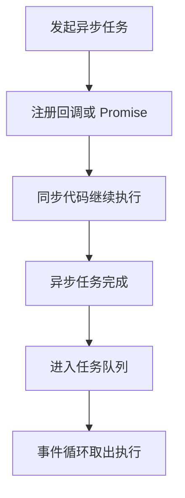

# 异步编程

## 定义

异步编程是在不阻塞主线程的情况下处理网络请求、定时器、文件读取、用户交互和任务调度的编程方式。JavaScript 中常见模型包括回调、Promise、async/await、事件循环和任务队列。

## 要点

- Promise 用状态机表达未来结果，核心概念包括 [[PromiseState]] 和 [[PromiseResult]]。
- async/await 是 Promise 的语法糖，让异步流程更接近同步写法。
- 浏览器中的异步任务会进入宏任务或微任务队列，由事件循环调度。
- 异步错误需要明确捕获，避免静默失败或未处理拒绝。

## 执行流程

## 实践检查清单

- 是否明确异步任务的成功、失败和取消路径。
- Promise 链是否返回了新的 Promise，避免悬空。
- async 函数是否用 try/catch 捕获错误。
- 多请求并发时是否区分 `Promise.all`、`allSettled` 和竞态处理。
- UI 状态是否覆盖 loading、empty、error 和 success。

## 案例

搜索框请求接口时，用户连续输入会产生多个请求。前端需要取消旧请求或只采纳最后一次结果，否则慢请求可能覆盖新请求，造成界面显示过期数据。

这类问题本质是异步结果到达顺序和用户意图顺序不一致。

## 相关概念

- [[PromiseState]]
- [[PromiseResult]]
- [[JavaScript]]
- [[浏览器]]
