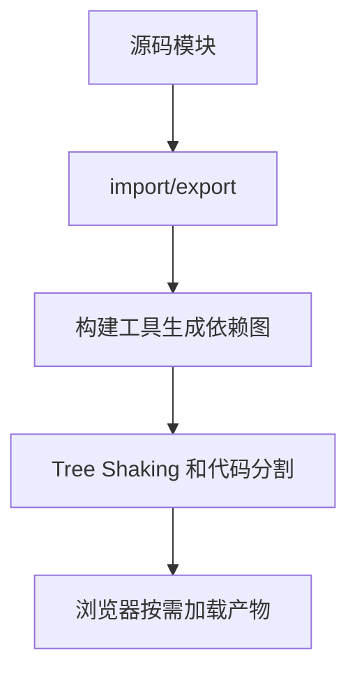

# 模块化

## 定义

模块化是把代码拆分为可复用、可组合、边界清晰的模块。前端模块体系经历了 IIFE、CommonJS、AMD、UMD 到 ESM 的演进。

## 要点

- ESM 使用静态 `import`/`export`，便于 Tree Shaking。
- CommonJS 主要用于 Node.js 传统生态。
- 构建工具会根据模块依赖图进行打包、分块和优化。

## 依赖流程

## 案例

组件库如果使用 ESM 导出按钮、表单和弹窗模块，业务项目可以只引入实际使用的模块，构建工具也更容易移除未使用代码。若库只提供一个大入口并混用副作用代码，最终包体积会更难控制。

## 检查清单

- 模块是否有清晰的输入、输出和副作用。
- 是否避免循环依赖。
- 公共入口是否会导致整包引入。
- 是否区分运行时代码和类型声明。
- 是否理解 ESM 与 CommonJS 在加载时机上的差异。

## 常见误区

- 把所有工具函数集中在一个大文件，导致依赖边界不清。
- 入口文件默认导出过多内容，使 Tree Shaking 失效。
- 模块初始化阶段执行请求、写缓存或读取全局状态，造成隐式副作用。
- 循环依赖在开发时不明显，构建或测试环境才暴露。

## 复盘提示

模块化质量可以通过依赖方向观察：底层工具不应依赖业务组件，业务模块不应互相循环引用，公共入口不应变成所有代码的中转站。依赖图越清晰，测试、构建和重构越稳定。

## 相关概念

- [[Vite 原理与插件机制总览]]
- [[Webpack]]
- [[代码分割]]
