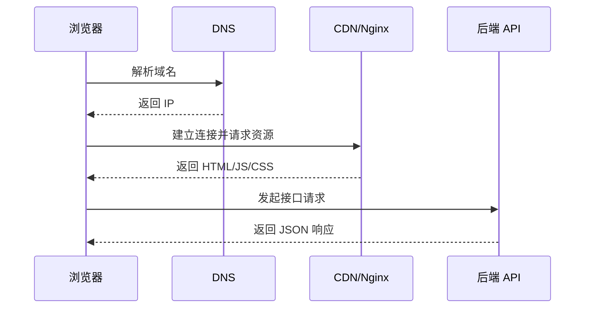

# 网络系列

- 网络对于前端开发来说尤其重要，在与后端对接数据的时候离不开网络请求
- 这个系列主要了解网络的构成，以及与软件开发相关的一些网络协议

## 网络是什么

- 网络是由若干节点和连接这些节点的链路构成，表示诸多对象及其相互联系
- 我们编写的网站一般都是部署在服务器上，当用户请求服务器时，通过网络传输数据，把前端代码发送到用户的浏览器上，浏览器通过解析代码呈现网站
- 在这个过程中，网络充当了远程传递数据的渠道，我们可以把网络比作马路，四通八达的马路，通向各个方向，当年在网上购物的时候，卖家通过快递公司，把物品送到你家，这里的快递公司我们可以类比为网络协议，而他们通过车从一个目的地发往另一个目的地，这里的马路就是网络中一条条线路
- 网络就是许许多多的线路组成的网，通过这些线路，发送的数据可以根据某些规定的规则发往指定地方
- 对于前端来说，我们通过网络与后端互相传递数据，后端是写在服务器上跑的代码，前端写的是在客户端上跑的代码，通过前端代码发送网络请求，在服务器接受请求，处理之后给客户端一个响应

## 了解网络能给我们带来什么

- 对于程序员来说天天和网络打交道，可以说网络知识也是基础功，当然我们顶多涉及到计算机相关的网络
- 理解网络协议可以帮助我们判断网络请求与响应的情况，判断在何种情况下使用什么样的协议，来达到预期效果
- 对网络传输过程的了解，可以帮助我们更好的理解数据的传送、数据的处理
- 了解网络还能对网络安全有一定的认识，从而保障用户在网络上传送数据的安全性

## 前端请求链路

## 学习重点

- DNS、TCP、TLS、HTTP 的基本流程。
- 浏览器缓存、CDN 缓存和接口缓存的区别。
- CORS、Cookie、Token、CSRF 的安全边界。
- HTTP 状态码、请求头、响应头和调试方法。

## 检查清单

- 遇到接口失败时，是否能区分 DNS、连接、TLS、CORS、HTTP 状态码和业务错误。
- 是否理解 GET/POST/PUT/DELETE 的语义差异。
- 是否知道 Cookie 的 SameSite、Secure、HttpOnly 对安全的影响。
- 是否能用浏览器 Network 面板定位慢请求。
