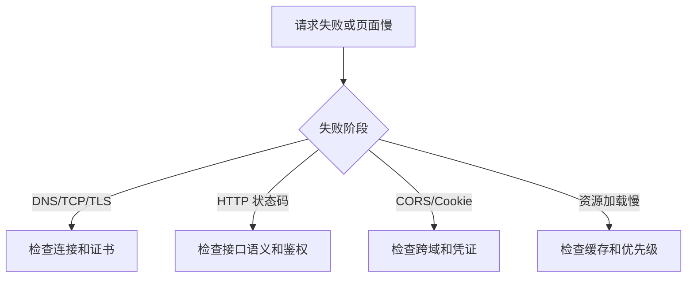

# 网络

## 定义

网络是前端与服务端通信的基础，涉及 HTTP、HTTPS、DNS、TCP、缓存、Cookie、CORS、WebSocket 和安全策略。

## 要点

- HTTP 方法和状态码决定接口语义。
- HTTPS 提供传输加密和身份校验。
- Cookie、Header 和 CORS 直接影响认证授权与跨域请求。
- 网络瀑布和资源优先级是性能优化的重要线索。

## 相关概念

- [[network/net]]
- [[RESTful API 设计]]
- [[前端安全总览：XSS、CSRF 与 CSP]]
- [[前后端接口契约]]

## 前端排查路径

## 实践检查清单

- 请求是否有超时、重试和取消策略。
- Cookie 是否设置 `Secure`、`HttpOnly`、`SameSite` 等属性。
- 跨域请求是否同时配置服务端 CORS 和客户端凭证模式。
- 静态资源是否使用缓存、压缩、HTTP/2 或 HTTP/3 能力。
- 关键接口是否有请求 ID，方便和后端日志关联。

## 案例

登录接口成功但刷新后变成未登录，常见原因是 Cookie 域名、路径、SameSite 或 HTTPS 属性不匹配。排查时应同时看响应头、浏览器存储和后续请求是否携带 Cookie。

## 常见误区

- 只看业务返回码，不看网络层状态、重定向和预检请求。
- 把 CORS 当成前端问题，实际需要服务端响应正确头部。
- 忽略缓存策略，导致发布后用户仍加载旧资源。
