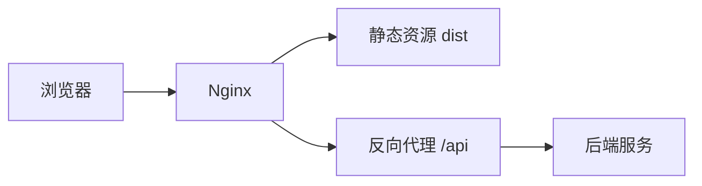

# Nginx 系列

## 定义

Nginx 是高性能 Web 服务器和反向代理，前端项目中常用于静态资源托管、单页应用路由回退、反向代理 API、HTTPS 终止和多项目部署。

## 使用场景



## 学习路径

1. 静态资源托管：理解 `root`、`index`、缓存头。
2. SPA 路由回退：用 `try_files` 支持前端路由刷新。
3. 反向代理：用 `proxy_pass` 转发 API。
4. HTTPS 和压缩：配置 TLS、gzip/brotli。
5. 多项目部署：按域名、路径或端口区分项目。

## 检查清单

- 静态资源是否设置长期缓存和内容哈希。
- `index.html` 是否避免过长缓存。
- 前端路由刷新是否不会 404。
- API 代理是否保留必要 Header 和 Trace ID。
- 是否有访问日志、错误日志和回滚方案。

## 示例配置

```nginx
location / {
  root /usr/share/nginx/html;
  try_files $uri $uri/ /index.html;
}

location /api/ {
  proxy_pass http://backend:8080/;
}
```

`try_files` 解决 SPA 刷新 404，`proxy_pass` 让前端页面通过同源路径访问后端 API。

## 常见误区

- 给 `index.html` 设置很长缓存，导致发布后用户拿不到新版本。
- 静态资源没有内容哈希，缓存策略无法安全拉长。
- 代理 API 时丢失 `Host`、`X-Forwarded-*` 或 Trace Header。

## 相关概念

- [[Nginx 多前端项目部署]]
- [[前后端项目部署方案详解]]
- [[CI-CD 流水线]]
