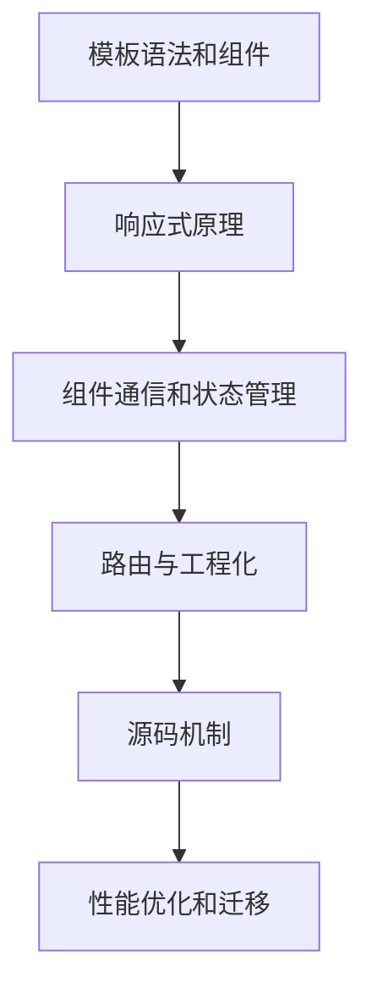

# Vue 框架系列

> Vue 是一套用于构建用户界面的**渐进式框架**。与其他大型框架不同的是，Vue 被设计为可以自底向上逐层应用。Vue 的核心库只关注视图层，不仅易于上手，还便于与第三方库或既有项目整合。

---

## 📚 知识库导航

> [!tip] 快速导航
> 请访问 [[MOC-Vue|Vue 知识库主索引]] 获取完整的知识体系导航

---

## 🗂️ 目录结构

```
vue/
├── 00-MOC/                          # MOC 索引
│   └── MOC-Vue.md                   # Vue 知识库主索引
├── 01-核心概念/                     # 核心概念
│   ├── Vue面试知识体系.md
│   ├── 响应式原理.md
│   ├── 虚拟DOM.md
│   └── 生命周期.md
├── 02-源码分析/                     # 源码分析
│   ├── 生命周期源码.md
│   ├── Computed源码.md
│   ├── Watch源码.md
│   ├── Patch源码.md
│   ├── Vue-Router源码.md
│   └── Vuex源码.md
├── 03-基础知识点/                   # 基础知识点
│   ├── 组件通信.md
│   └── Vue重点知识.md
├── img/                             # 图片资源
└── README.md                        # 本文件
```

---

## 📖 核心内容

### 🎯 面试知识体系
- [[Vue面试知识体系|📖 Vue 面试知识点体系]] - 基于《2024前端高频面试题之--VUE篇》整理的完整知识体系

### 🏗️ 核心概念
- [[响应式原理|双向绑定与响应式原理]] - 数据劫持、依赖收集、发布订阅模式详解
- [[虚拟DOM|虚拟 DOM 与 Diff 算法]] - VNode、Diff策略、Key优化
- [[生命周期|Vue 生命周期]] - 8大生命周期钩子详解

### 🔧 源码分析
- [[生命周期源码|生命周期源码分析]] - 从 new Vue() 到 mounted 全过程
- [[Computed源码|Computed 源码分析]] - 计算属性缓存与惰性求值
- [[Watch源码|Watch 源码分析]] - 侦听器实现与深度监听
- [[Patch源码|Patch 源码分析]] - DOM 更新与 Diff 算法
- [[Vue-Router源码|Vue Router 源码分析]] - 路由实现与导航守卫
- [[Vuex源码|Vuex 源码分析]] - 状态管理原理

### 📝 基础知识点
- [[组件通信|组件间通信方式汇总]] - Props、Event Bus、Vuex 等通信方式
- [[Vue重点知识|Vue 重点知识详解]] - Mixin、v-if/v-show、插槽、动态组件等

---

## 🎓 学习路径

### 初级（基础使用）
1. [[生命周期|生命周期]]
2. [[Vue重点知识|基础语法]]
3. [[组件通信|组件通信]]

### 中级（原理理解）
1. [[响应式原理|响应式原理]]
2. [[虚拟DOM|虚拟DOM]]
3. [[Vue面试知识体系|面试知识体系]]

### 高级（源码掌握）
1. [[生命周期源码|生命周期源码]]
2. [[Computed源码|Computed源码]]
3. [[Watch源码|Watch源码]]
4. [[Patch源码|Patch源码]]
5. [[Vue-Router源码|Router源码]]
6. [[Vuex源码|Vuex源码]]



## 工程场景

Vue 适合渐进式接入和中后台业务开发。项目设计时要先区分组件局部状态、跨组件状态和服务端数据，再选择 Props/Emit、Provide/Inject、Vuex 或 Pinia。源码学习的重点不是背实现细节，而是理解响应式、渲染、Patch 和生命周期如何共同决定页面更新。

## 检查清单

- 组件边界是否清晰，Props 和事件是否语义明确。
- 响应式数据是否避免深层不可控修改。
- 列表渲染是否使用稳定 Key。
- 路由、权限、缓存页面和异步组件是否有统一策略。
- Vue 2 与 Vue 3 的 API 和响应式差异是否标注清楚。

---

## 🔗 相关链接

- [Vue 官方文档](https://vuejs.org/)
- [Vue Router 文档](https://router.vuejs.org/)
- [Vuex 文档](https://vuex.vuejs.org/)
- [Vue3 文档](https://vuejs.org/guide/introduction.html)

---

## 📝 说明

- 本知识库基于 Vue 2.x 版本整理，部分内容涉及 Vue 3.x
- 源码分析基于 Vue 2.6.11、Vue Router 3.5.1、Vuex 3.6.2
- 面试知识体系参考掘金《2024前端高频面试题之--VUE篇》

---

> [!note] 使用 Obsidian 阅读效果更佳
> 本知识库采用 Obsidian 知识库结构规范整理，建议使用 Obsidian 打开以获得最佳阅读体验（支持双向链接、图谱视图等功能）

---

*最后更新：2025-02-11*
