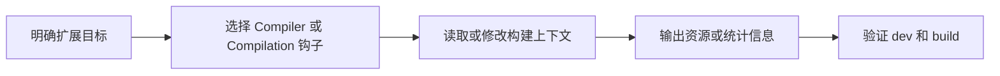

# Plugin 详解

## 1. Plugin 是什么？

Plugin 是 webpack 的扩展机制，通过监听 webpack 构建过程中发布的**钩子(hooks)**，在特定时机执行自定义逻辑，从而影响构建结果。

### Plugin 特点

- **基于事件流**：通过 tapable 实现发布订阅模式
- **功能丰富**：可执行范围更广的任务（压缩、优化、资源管理）
- **生命周期干预**：可在构建各阶段介入

---
## 2. 常见 Plugin 及作用

### 2.1 HTML 生成

| Plugin | 作用 |
|--------|------|
| `html-webpack-plugin` | 自动生成 HTML 文件并引入打包后的资源 |
| `web-webpack-plugin` | 为单页面应用输出 HTML（性能更优） |

```javascript
const HtmlWebpackPlugin = require('html-webpack-plugin');

plugins: [
  new HtmlWebpackPlugin({
    template: './src/index.html',  // 模板文件
    filename: 'index.html',         // 输出文件名
    minify: {                       // 压缩配置
      collapseWhitespace: true,
      removeComments: true
    },
    chunks: ['main']  // 指定引入的 chunk
  })
]
```

### 2.2 CSS 处理

| Plugin | 作用 |
|--------|------|
| `mini-css-extract-plugin` | 将 CSS 提取为独立文件（生产环境替代 style-loader） |
| `css-minimizer-webpack-plugin` | 压缩 CSS 代码 |
| `purgecss-webpack-plugin` | 移除未使用的 CSS |

```javascript
const MiniCssExtractPlugin = require('mini-css-extract-plugin');
const CssMinimizerPlugin = require('css-minimizer-webpack-plugin');

plugins: [
  new MiniCssExtractPlugin({
    filename: 'css/[name].[contenthash:8].css'
  })
],
optimization: {
  minimizer: [
    new CssMinimizerPlugin()  // 压缩 CSS
  ]
}
```

### 2.3 代码优化与压缩

| Plugin | 作用 |
|--------|------|
| `terser-webpack-plugin` | 压缩 ES6 代码（Webpack 5 内置） |
| `uglifyjs-webpack-plugin` | 压缩 JS 代码（Webpack 4） |
| `webpack-bundle-analyzer` | 可视化分析打包体积 |

```javascript
const TerserPlugin = require('terser-webpack-plugin');

optimization: {
  minimizer: [
    new TerserPlugin({
      parallel: true,        // 多线程压缩
      extractComments: false // 不提取注释
    })
  ]
}
```

### 2.4 构建优化

| Plugin | 作用 |
|--------|------|
| `clean-webpack-plugin` | 每次打包前清理输出目录 |
| `copy-webpack-plugin` | 复制静态资源到输出目录 |
| `ignore-plugin` | 忽略指定文件，加快构建速度 |
| `speed-measure-webpack-plugin` | 分析 loader 和 plugin 耗时 |

```javascript
const { CleanWebpackPlugin } = require('clean-webpack-plugin');
const CopyWebpackPlugin = require('copy-webpack-plugin');

plugins: [
  new CleanWebpackPlugin(),  // 清理 dist 目录
  new CopyWebpackPlugin({
    patterns: [
      { from: 'public', to: 'assets' }
    ]
  })
]
```

### 2.5 代码分割与懒加载

| Plugin | 作用 |
|--------|------|
| `split-chunks-plugin` | 代码分割（Webpack 内置） |
| `preload-webpack-plugin` | 预加载资源 |

```javascript
optimization: {
  splitChunks: {
    chunks: 'all',
    cacheGroups: {
      vendors: {
        test: /[\\/]node_modules[\\/]/,
        name: 'vendors',
        chunks: 'all'
      },
      common: {
        minChunks: 2,
        chunks: 'all',
        enforce: true
      }
    }
  }
}
```

### 2.6 开发体验

| Plugin | 作用 |
|--------|------|
| `hot-module-replacement-plugin` | 模块热替换（HMR） |
| `webpack-dashboard` | 可视化展示打包信息 |
| `progress-plugin` | 显示打包进度 |
| `unused-webpack-plugin` | 查找未使用的文件 |

```javascript
const DashboardPlugin = require('webpack-dashboard/plugin');

plugins: [
  new webpack.HotModuleReplacementPlugin(),
  new DashboardPlugin()
]
```

### 2.7 其他实用 Plugin

| Plugin | 作用 |
|--------|------|
| `define-plugin` | 定义全局环境变量 |
| `provide-plugin` | 自动加载模块（如注入 $） |
| `banner-plugin` | 在 chunk 头部添加 banner |
| `compression-webpack-plugin` | 生成 gzip 压缩文件 |
| `serviceworker-webpack-plugin` | 生成 Service Worker（PWA） |
| `dll-plugin` | 动态链接库，预编译第三方库 |
| `scope-hoisting-plugin` | 作用域提升（Webpack 4+ 内置） |

```javascript
const webpack = require('webpack');
const CompressionPlugin = require('compression-webpack-plugin');

plugins: [
  // 定义环境变量
  new webpack.DefinePlugin({
    'process.env.NODE_ENV': JSON.stringify('production'),
    __VERSION__: JSON.stringify('1.0.0')
  }),
  
  // 自动注入 jquery
  new webpack.ProvidePlugin({
    $: 'jquery',
    jQuery: 'jquery'
  }),
  
  // gzip 压缩
  new CompressionPlugin({
    algorithm: 'gzip',
    test: /\.(js|css)$/,
    threshold: 10240,
    minRatio: 0.8
  })
]
```

---

## 3. 如何编写 Plugin

### 3.1 基本结构

```javascript
// my-plugin.js
class MyPlugin {
  constructor(options) {
    this.options = options;
  }

  apply(compiler) {
    // compiler 是 webpack 实例，包含完整配置信息
    
    // 在特定钩子中注册回调
    compiler.hooks.done.tap('MyPlugin', (stats) => {
      console.log('构建完成！');
      console.log('编译统计:', stats);
    });
  }
}

module.exports = MyPlugin;
```

### 3.2 常用钩子

```javascript
class MyPlugin {
  apply(compiler) {
    // 初始化完成
    compiler.hooks.initialize.tap('MyPlugin', () => {
      console.log('初始化完成');
    });

    // 编译开始
    compiler.hooks.compile.tap('MyPlugin', (params) => {
      console.log('编译开始');
    });

    // 创建 compilation 对象后
    compiler.hooks.compilation.tap('MyPlugin', (compilation) => {
      console.log('创建 compilation');
      
      // 在 compilation 上也可以注册钩子
      compilation.hooks.optimize.tap('MyPlugin', () => {
        console.log('优化阶段');
      });
    });

    // 开始构建
    compiler.hooks.make.tap('MyPlugin', (compilation) => {
      console.log('开始构建');
    });

    // 构建完成
    compiler.hooks.done.tap('MyPlugin', (stats) => {
      console.log('构建完成');
    });

    // 构建失败
    compiler.hooks.failed.tap('MyPlugin', (error) => {
      console.log('构建失败:', error);
    });
  }
}
```

### 3.3 异步钩子处理

```javascript
class MyPlugin {
  apply(compiler) {
    // 异步串行钩子
    compiler.hooks.emit.tapAsync('MyPlugin', (compilation, callback) => {
      setTimeout(() => {
        console.log('异步操作完成');
        callback();  // 必须调用 callback
      }, 1000);
    });

    // 使用 Promise
    compiler.hooks.emit.tapPromise('MyPlugin', (compilation) => {
      return new Promise((resolve) => {
        setTimeout(() => {
          console.log('Promise 完成');
          resolve();
        }, 1000);
      });
    });
  }
}
```

### 3.4 操作构建资源

```javascript
class FileListPlugin {
  apply(compiler) {
    compiler.hooks.emit.tapAsync('FileListPlugin', (compilation, callback) => {
      // 获取所有资源
      const assets = compilation.assets;
      
      // 生成文件列表
      let fileList = '文件列表:\n\n';
      
      for (const filename in assets) {
        fileList += `- ${filename} (${assets[filename].size()} bytes)\n`;
      }

      // 添加新资源到输出
      compilation.assets['file-list.txt'] = {
        source() {
          return fileList;
        },
        size() {
          return fileList.length;
        }
      };

      callback();
    });
  }
}
```

---

## 4. Compiler 与 Compilation

### 4.1 Compiler

- **全局单例**：整个 webpack 生命周期只有一个
- **完整配置**：包含 webpack 完整配置信息
- **生命周期钩子**：暴露 200+ 个钩子

### 4.2 Compilation

- **每次构建创建**：每次热更新或重新编译都会创建新的 compilation
- **当前构建上下文**：包含当次构建的模块、依赖、资源等信息
- **细粒度钩子**：暴露更细粒度的构建阶段钩子

```javascript
class MyPlugin {
  apply(compiler) {
    compiler.hooks.compilation.tap('MyPlugin', (compilation) => {
      // compilation 对象
      console.log(compilation.modules);     // 模块集合
      console.log(compilation.chunks);      // chunk 集合
      console.log(compilation.assets);      // 资源集合
      console.log(compilation.errors);      // 错误集合
      console.log(compilation.warnings);    // 警告集合
    });
  }
}
```

---

## 5. Tapable 钩子类型

webpack 使用 tapable 库实现钩子机制：

| 钩子类型 | 执行方式 | 说明 |
|---------|---------|------|
| `SyncHook` | 同步串行 | 依次执行，不关心返回值 |
| `SyncBailHook` | 同步串行 | 返回非 undefined 则停止 |
| `SyncWaterfallHook` | 同步串行 | 上一个返回值传给下一个 |
| `SyncLoopHook` | 同步循环 | 返回非 undefined 则循环 |
| `AsyncParallelHook` | 异步并行 | 并行执行 |
| `AsyncParallelBailHook` | 异步并行 | 某个返回则停止 |
| `AsyncSeriesHook` | 异步串行 | 依次执行 |
| `AsyncSeriesBailHook` | 异步串行 | 返回非 undefined 则停止 |
| `AsyncSeriesWaterfallHook` | 异步串行 | 上一个返回值传给下一个 |

```javascript
// 使用示例
compiler.hooks.compile.tap('MyPlugin', () => {
  // 同步钩子使用 tap
});

compiler.hooks.emit.tapAsync('MyPlugin', (compilation, callback) => {
  // 异步钩子使用 tapAsync
  callback();
});

compiler.hooks.emit.tapPromise('MyPlugin', (compilation) => {
  // 异步钩子使用 tapPromise
  return Promise.resolve();
});
```

---

## 6. 实战：编写一个简单 Plugin

```javascript
// console-clear-plugin.js
class ConsoleClearPlugin {
  constructor(options = {}) {
    this.options = {
      clearOnHotUpdate: true,
      ...options
    };
  }

  apply(compiler) {
    const pluginName = 'ConsoleClearPlugin';

    // 开发服务器重启时清屏
    compiler.hooks.beforeCompile.tap(pluginName, () => {
      if (process.env.NODE_ENV === 'development') {
        console.clear();
        console.log('🚀 开始编译...\n');
      }
    });

    // 编译完成
    compiler.hooks.done.tap(pluginName, (stats) => {
      const info = stats.toJson();
      
      if (stats.hasErrors()) {
        console.error('❌ 编译失败！');
        info.errors.forEach(error => console.error(error));
        return;
      }

      if (stats.hasWarnings()) {
        console.warn('⚠️ 编译有警告');
        info.warnings.forEach(warning => console.warn(warning));
      }

      console.log('✅ 编译成功！');
      console.log(`   耗时: ${info.time}ms`);
      console.log(`   模块数: ${info.modules}`);
    });
  }
}

module.exports = ConsoleClearPlugin;
```

## 实践流程



## 实践检查清单

- Plugin 是否只处理构建生命周期任务，而不是文件内容转换。
- 钩子选择是否尽量靠近真实需求，避免过早或过晚执行。
- 异步钩子是否正确调用 callback 或返回 Promise。
- 是否处理错误和 warning，并给出可定位信息。
- 是否在最小示例项目中验证不同模式下的行为。

## 案例

需要在构建完成后上传 source map，应使用构建后期钩子读取输出资源并上传；如果只是把 Sass 转 CSS，则应使用 Loader，而不是 Plugin。

## 常见误区

- 在 Plugin 中做大量同步 IO，拖慢构建。
- 异步钩子忘记结束，导致构建卡住。
- Plugin 修改产物但没有更新 source map 或 hash。

## 掘金文章补充

掘金文章《loader和plugin区别》把 Plugin 定位为构建生命周期的事件监听与处理器。Plugin 通过 `apply(compiler)` 注册钩子，既可以在编译前后读取上下文，也可以在 emit 阶段操作资源、生成 HTML、压缩代码、注入环境变量或处理热更新。

判断是否该写 Plugin，可以看需求是否跨文件、跨资源或依赖构建阶段。如果只是把一个文件从 A 格式转换为 B 格式，用 Loader；如果要影响构建流程、读取统计信息、生成额外资源或修改输出资产，用 Plugin。

来源：[loader和plugin区别](https://juejin.cn/post/7521602463461834787)
