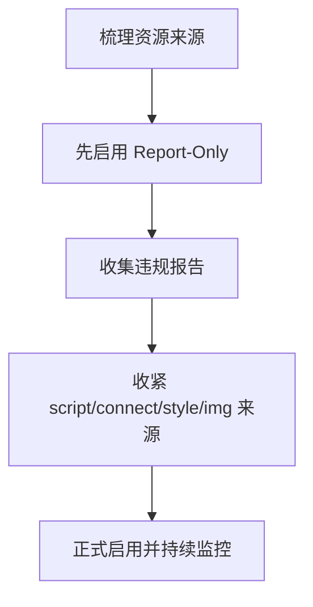

# CSP 内容安全策略

## 定义

CSP 是通过 HTTP 响应头限制页面可加载脚本、样式、图片、字体和连接来源的浏览器安全机制。

## 要点

- `script-src` 控制脚本来源。
- `connect-src` 控制接口、WebSocket 等连接来源。
- `img-src`、`style-src`、`font-src` 控制资源来源。
- 可先使用 Report-Only 模式观察影响。

## 配置流程

## 案例

一个管理后台通常只允许加载自身域名脚本、指定 CDN 字体和后端 API 域名。若页面不需要第三方脚本，就应避免使用 `unsafe-inline` 和过宽的 `*`，否则 CSP 对 [[XSS 攻击与防护]] 的补强价值会明显下降。

## 检查清单

- 是否先盘点脚本、样式、图片、字体和接口来源。
- 是否使用 Report-Only 观察线上影响。
- 是否避免过宽的 `*`、`unsafe-inline` 和 `unsafe-eval`。
- 是否为违规报告配置收集端点。
- 是否在新增第三方资源时同步更新策略。

## 常见误区

- 一开始就强制启用严格策略，导致线上资源被误拦截。
- 为了省事放开 `unsafe-inline`，削弱 XSS 防护效果。
- 只配置脚本来源，忽视接口、图片、字体和 iframe。
- 没有收集违规报告，策略变更后无法评估影响。

## 相关概念

- [[XSS 攻击与防护]]
- [[前端安全总览：XSS、CSRF 与 CSP]]
