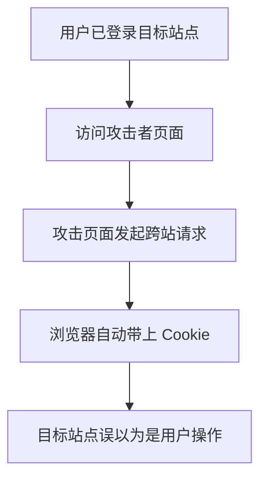

# CSRF 攻击与防护

## 定义

CSRF 是攻击者诱导已登录用户向目标站点发起非预期请求的攻击方式，利用的是浏览器自动携带 Cookie 的机制。

## 防护

- 重要写操作使用 CSRF Token。
- Cookie 设置 `SameSite`。
- 校验 Origin 或 Referer。
- 关键操作增加二次确认。

## 攻击流程

## 案例

如果转账接口只依赖 Cookie 登录态，攻击者可以诱导用户访问一个隐藏表单页面，让浏览器向目标站点提交转账请求。后端若没有 CSRF Token、SameSite Cookie 或 Origin 校验，就可能执行非用户本意的写操作。

## 检查清单

- 写接口是否只依赖 Cookie 认证。
- Cookie 是否配置合适的 `SameSite`。
- 后端是否校验 CSRF Token 或 Origin。
- GET 请求是否避免产生副作用。
- 高风险操作是否有二次确认或风控。

## 复盘提示

CSRF 防护要从“浏览器会自动带 Cookie”这个事实出发。若接口改用 Authorization Header 承载 Token，CSRF 风险通常下降，但仍要评估 XSS、CORS 配置和敏感操作确认，不能只看单一攻击类型。

最终判断标准是：攻击站点能否在用户不知情时完成一次有效写操作。

## 相关概念

- [[前端安全总览：XSS、CSRF 与 CSP]]
- [[认证授权总览：Session、JWT、OAuth2 与 OIDC]]
