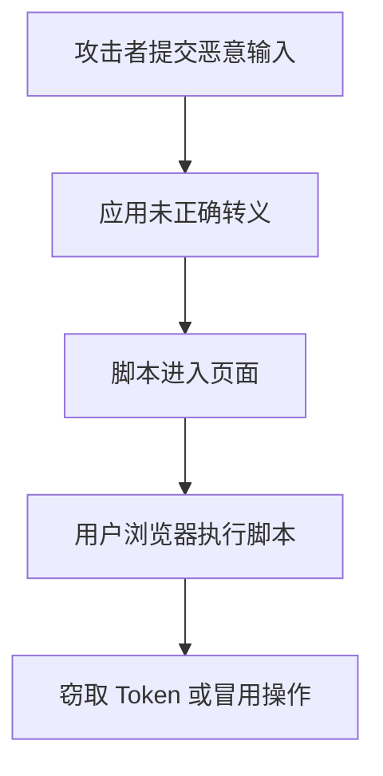

# XSS 攻击与防护

## 定义

XSS 是攻击者把恶意脚本注入页面并在用户浏览器中执行的攻击方式，常用于窃取凭证、冒用操作或篡改页面。

## 防护

- 对不可信输入按上下文转义。
- 避免直接插入不可信 HTML。
- 富文本使用可信清洗库。
- 配置 [[CSP 内容安全策略]]。

## 攻击流程

## 案例

评论区如果直接把用户输入拼接成 HTML，攻击者可以提交带脚本的内容，其他用户打开页面时脚本会在其浏览器中执行。React/Vue 默认会对文本插值做转义，但 `dangerouslySetInnerHTML`、富文本预览和 Markdown 渲染仍然需要额外清洗。

## 检查清单

- 输入是否被当作 HTML、URL、CSS 或 JS 上下文使用。
- 富文本是否经过可信白名单清洗。
- Token 是否避免放在容易被脚本读取的位置。
- CSP 是否限制脚本来源和内联脚本。
- 安全测试是否覆盖存储型、反射型和 DOM 型 XSS。

## 常见误区

- 以为框架默认转义就完全没有 XSS 风险。
- 对富文本、Markdown、URL 参数和第三方嵌入内容缺少清洗。
- 只做输入过滤，没有按输出上下文转义。
- CSP 配置过宽，允许任意内联脚本执行。

## 复盘提示

排查 XSS 风险时要按“输入来源、存储位置、输出上下文、浏览器执行点”四步走。只看提交表单是不够的，URL 参数、接口返回、Markdown 渲染、第三方脚本和日志预览都可能成为脚本进入页面的通道。

## 相关概念

- [[前端安全总览：XSS、CSRF 与 CSP]]
- [[前端鉴权与 Token 存储安全]]
