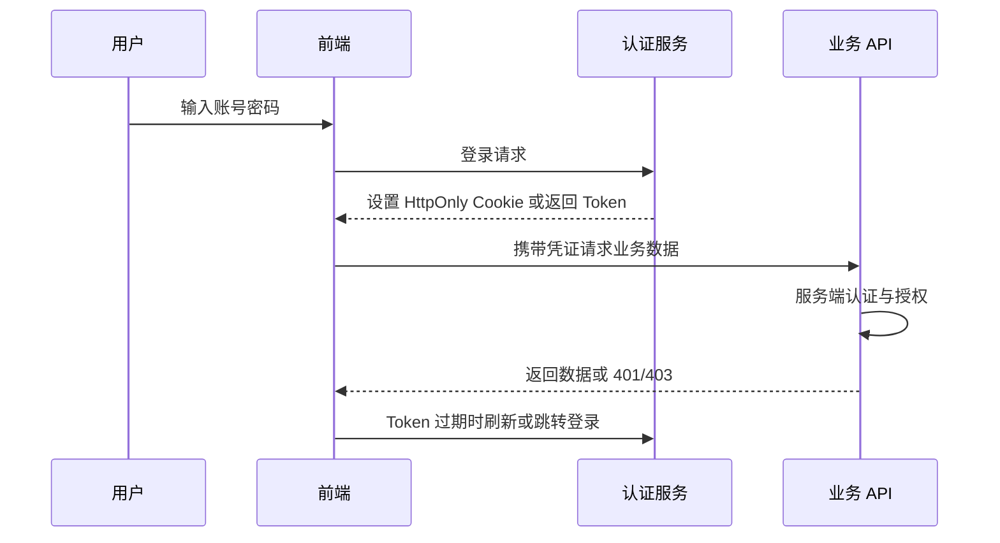

# 前端鉴权与 Token 存储安全

## 定义

前端鉴权与 Token 存储安全关注登录态在浏览器中的保存、读取、刷新和失效处理。前端只能改善体验，最终授权必须由服务端校验。

## 要点

- HttpOnly Cookie 能降低 XSS 窃取 Token 风险。
- localStorage 使用方便，但暴露给脚本，XSS 风险更高。
- Access Token 生命周期应短，刷新和撤销要有服务端策略。
- 权限按钮隐藏不能替代后端授权。

## 登录态流程

前端负责保存凭证、处理过期、控制页面体验；服务端必须在每次敏感请求中校验身份和资源权限。

## 存储方案对比

| 方案 | 优点 | 风险 | 适合场景 |
|---|---|---|---|
| HttpOnly Cookie | JS 读不到，降低 Token 被 XSS 窃取风险 | 需要处理 CSRF、SameSite、跨域 Cookie | Web 登录态 |
| memory 内存 | 刷新即丢，泄露面小 | 刷新页面需重新获取登录态 | 高敏感后台 |
| sessionStorage | 标签页级别，生命周期短 | 仍可被 XSS 读取 | 低风险短会话 |
| localStorage | 使用简单，刷新不丢 | XSS 后可直接读取 | 不建议存高权限 Token |

## 案例

后台管理系统使用短期 Access Token + HttpOnly Refresh Cookie：

1. 登录后服务端设置 Refresh Cookie，前端内存保存 Access Token。
2. Access Token 过期时，前端调用刷新接口获取新 Token。
3. 刷新失败时清理本地状态并跳转登录页。
4. 服务端维护刷新 Token 的撤销、轮换和设备维度审计。

这样能降低长期 Token 被脚本读取的风险，同时保留较好的用户体验。

## 检查清单

- Token 是否设置较短有效期，刷新 Token 是否可撤销和轮换。
- Cookie 是否配置 `HttpOnly`、`Secure`、`SameSite`。
- 前端路由守卫是否只做体验控制，不承担最终授权。
- 401、403 是否区分处理：未登录跳登录，无权限展示拒绝访问。
- XSS 防护是否和 [[CSP 内容安全策略]]、输入输出转义一起设计。
- 退出登录是否同时清理前端状态和服务端会话或刷新凭证。

## 掘金文章补充

掘金文章《web端安全问题有哪些？》再次强调：`localStorage` 存 Token 的主要风险是 XSS 后脚本可直接读取；安全优先时更推荐 HttpOnly Cookie，并配合 `SameSite`、`Secure`、CSRF Token 或 Origin/Referer 校验。若业务必须把 Access Token 放在前端可读位置，应缩短有效期、减少权限范围，并建立刷新、撤销和异常设备审计。

还要避免把“前端隐藏入口”误认为授权。前端可以拦路由、隐藏按钮、优化 401/403 体验，但每个敏感 API 都需要服务端鉴权和资源级授权，尤其是导出、支付、审批、删除等操作。

来源：[web端安全问题有哪些？](https://juejin.cn/post/7584320417307394099)

## 相关概念

- [[认证授权总览：Session、JWT、OAuth2 与 OIDC]]
- [[XSS 攻击与防护]]
- [[CSRF 攻击与防护]]
- [[API 安全基础]]
