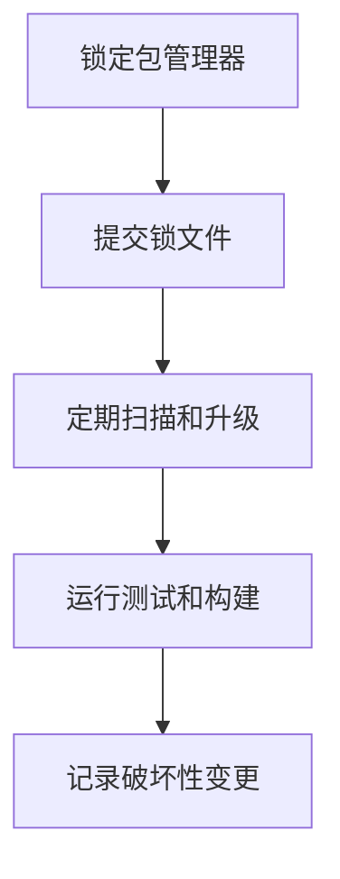

# 包管理与依赖治理

## 定义

包管理与依赖治理是前端项目对依赖安装、版本锁定、升级、安全扫描、重复依赖、构建产物和 Monorepo 工作流的系统管理。它决定项目能否稳定复现、快速安装、可靠升级和控制供应链风险。

## 要点

- 锁文件必须进入版本控制，保证 CI、本地和生产构建使用一致依赖图。
- 依赖升级要区分补丁升级、功能升级和破坏性升级，并配合自动化测试。
- 对构建工具、框架、编译器、测试框架等核心依赖要建立升级节奏。
- 避免同时混用 npm、yarn、pnpm 产生多个锁文件。
- 安全治理需要关注漏洞、弃用包、安装脚本和不必要的生产依赖。

## 典型工具

- npm、pnpm、Yarn：包安装与工作区管理。
- Renovate、Dependabot：自动依赖更新。
- lockfile-lint、npm audit、pnpm audit：锁文件与安全检查。
- Changesets：Monorepo 包版本和变更日志管理。

## 治理流程

## 案例

团队从 npm 切换到 pnpm 时，应删除旧锁文件，固定 `packageManager` 字段，更新 CI 安装命令，并验证构建、测试和部署流程。若只在本地切换而不治理锁文件，团队成员和 CI 很容易得到不同依赖图。

## 检查清单

- 仓库是否只保留一种锁文件。
- 核心依赖是否有升级负责人和节奏。
- 自动升级 PR 是否有测试和回滚路径。
- 生产依赖与开发依赖是否区分清楚。
- 是否监控弃用包、漏洞和安装脚本风险。

## 相关概念

- [[Vite 原理与插件机制总览]]
- [[TypeScript 工程实践总览]]
- [[前端测试体系总览]]
- [[云原生部署总览：Docker、Kubernetes 与 CI-CD]]
- [[CI-CD 流水线]]
