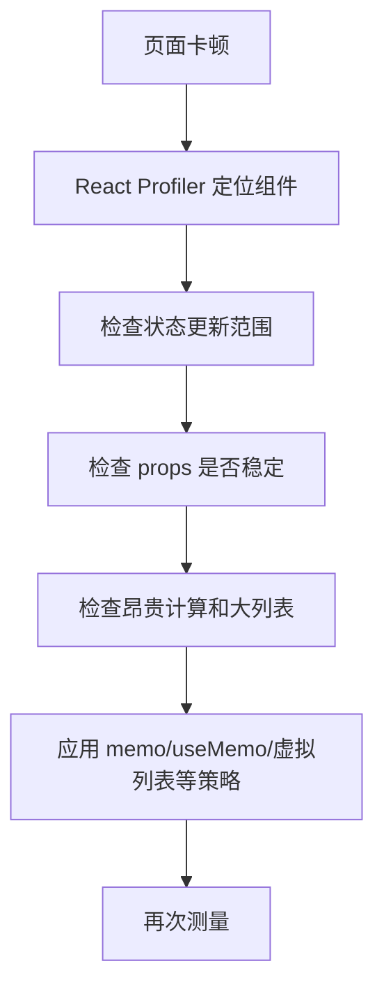

# React 性能优化实战

## 定义

React 性能优化是通过减少不必要渲染、控制组件边界、优化列表、拆分代码和管理服务器状态来改善用户体验的实践。

## 要点

- 先用 Profiler 和真实指标定位瓶颈。
- 使用 [[记忆化]] 控制昂贵计算和不稳定引用。
- 通过 [[组件设计与状态边界]] 降低状态变化影响范围。
- 大列表使用 [[虚拟列表]]。

## 排查流程

## 案例

订单列表页输入筛选条件时整页卡顿：

- 如果筛选输入状态放在页面顶层，所有表格和弹窗都会重渲染。
- 可以把输入框局部状态下沉，或用防抖后再更新查询条件。
- 表格行很多时使用虚拟列表。
- 接口数据交给 [[TanStack-Query]]，不要复制进全局 Store。

## 检查清单

- 是否先测量再优化。
- 是否避免为了“性能”到处加 `memo`。
- 是否让状态靠近使用位置。
- 列表是否有稳定 `key` 和分页/虚拟化策略。
- 优化后是否对比 [[Web Vitals 核心指标]] 或 Profiler 结果。

## 常见误区

- 不看 Profiler，凭感觉给所有组件加 `React.memo`。
- `useCallback` 依赖频繁变化，实际没有稳定引用。
- 把服务器数据复制到全局 Store，造成缓存和渲染都难管理。
- 大列表只优化行组件，却不做虚拟化或分页。

## 落地顺序

1. 先用 Profiler 找到慢组件和渲染原因。
2. 缩小状态更新范围。
3. 稳定关键 props 和选择器。
4. 处理大列表、重计算和大依赖。
5. 回到真实指标验证体验是否改善。

## 相关概念

- [[React 性能优化]]
- [[Web Vitals 核心指标]]
- [[代码分割]]
