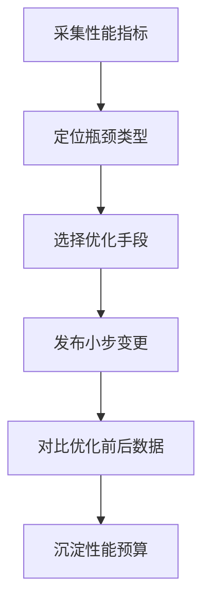

# 前端性能优化清单

## 加载优化

- 减少首屏关键资源体积。
- 图片使用合适格式、尺寸和懒加载。
- 使用 HTTP 缓存、预加载和 CDN。
- 对路由和大模块做 [[代码分割]]。

## 渲染优化

- 避免长任务阻塞主线程。
- 控制不必要的组件重渲染。
- 大列表使用 [[虚拟列表]]。
- 为图片和异步内容预留尺寸，降低 CLS。

## 优化流程

## 实践案例

首屏慢不要一开始就重构组件。先确认 LCP 元素、资源瀑布和 JS 执行时间：

- LCP 是首屏图片：优先改图片格式、尺寸、预加载。
- JS 体积过大：做 [[代码分割]] 和依赖分析。
- 接口慢：优化后端响应、缓存或骨架屏。
- 渲染慢：再看组件重渲染和长任务。

## 检查清单

- 是否有真实用户监控数据。
- 是否按加载、渲染、交互、稳定性分类处理。
- 是否避免一次性做大重构，优先小步验证。
- 是否设置包体积、LCP、INP、CLS 的预算。

## 常见误区

- 没有指标就开始优化，最后无法判断收益。
- 只优化 JS 包体积，忽略图片、字体、接口和缓存。
- 为了减少请求把所有代码打进一个大包，反而拖慢首屏。
- 优化只在本机验证，不看低端设备和慢网络。

## 性能预算示例

- 首屏 JS gzip 后控制在约定阈值内。
- P75 LCP、INP、CLS 达到团队目标。
- 单个路由新增依赖需要说明体积影响。
- 关键页面发布后必须对比优化前后数据。

## 相关概念

- [[Web Vitals 核心指标]]
- [[React 性能优化实战]]
- [[前端监控与错误上报]]
