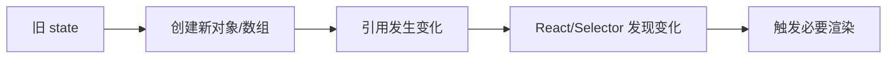

# 不可变性

## 定义

不可变性是指数据更新时不直接修改原对象，而是创建包含变更的新对象。前端状态管理中使用不可变性，可以让变化检测、回溯调试、缓存和组件渲染优化更可靠。

## 要点

- 不可变更新让引用变化可以表达“数据已变化”。
- React、Redux 和选择器缓存都依赖稳定的引用语义。
- 深层对象更新要避免只浅拷贝外层却修改内层对象。
- Immer 等工具可以用可变写法生成不可变结果。

## 示例

更新数组项时优先使用 `map` 创建新数组，而不是直接修改原数组元素。

```typescript
const nextTodos = todos.map((todo) =>
  todo.id === targetId ? { ...todo, done: true } : todo
);
```

## 变化检测流程



如果直接修改原对象，引用可能保持不变，依赖浅比较的组件、选择器或缓存就可能无法发现变化。

## 常见误区

- 只浅拷贝第一层，却继续修改深层对象。
- 为了不可变性手写大量复杂展开，导致代码难读；复杂场景可使用 Immer。
- 把不可变性理解为“所有数据都不能变”，实际重点是状态更新边界要产生新引用。

## 检查清单

- 更新数组是否使用 `map`、`filter`、`concat` 等返回新数组的方法。
- 更新对象是否创建新对象，而不是直接改原对象字段。
- 深层对象是否有明确更新路径或使用 Immer。
- 性能敏感场景是否避免无意义创建大量新对象。

## 相关概念

- [[Redux]]
- [[选择器模式]]
- [[状态管理 MOC]]
- [[组件设计与状态边界]]
