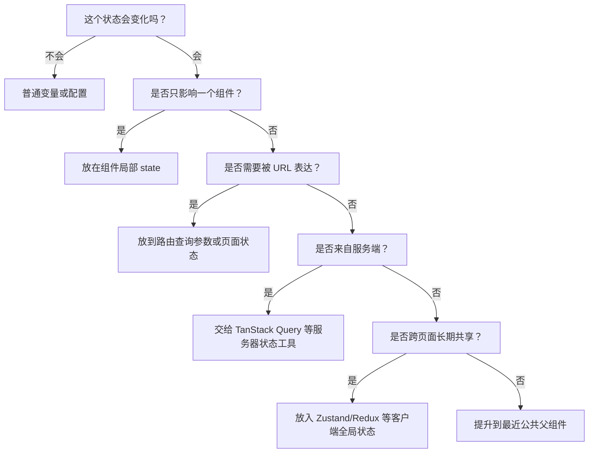

# 组件设计与状态边界

## 定义

组件设计与状态边界是把界面拆分为可理解、可复用、可测试单元的架构方法。核心问题不是“状态放在哪里”，而是哪些状态属于组件局部、哪些属于页面流程、哪些属于全局客户端状态、哪些属于服务器状态。

## 状态分类

- **局部状态**：输入框值、展开收起、悬浮状态等，只影响单个组件。
- **页面状态**：筛选条件、分页、当前步骤等，通常和路由或页面容器绑定。
- **客户端全局状态**：主题、登录用户、权限、布局偏好等跨页面状态。
- **服务器状态**：接口数据、缓存、重新验证、加载和错误状态，优先交给 [[TanStack-Query]] 等工具。

## 设计原则

- 组件边界围绕稳定职责划分，而不是围绕文件大小机械拆分。
- 可复用组件只暴露必要 API，业务状态留在页面或业务容器。
- 派生状态尽量计算得到，避免复制一份容易不同步的数据。
- 表单、表格、筛选器等复杂组件要明确受控与非受控模式。

## 状态归属决策树

这个决策树的目的不是给出唯一答案，而是防止一开始就把所有状态塞进全局 Store。状态越靠近使用它的地方，组件越容易理解和测试。

## 组件拆分案例

以“订单列表页”为例，可以把组件边界拆成三层：

- `OrderListPage`：负责读取 URL 查询参数、调用接口、处理页面级错误和空状态。
- `OrderFilters`：负责筛选表单展示，把筛选结果通过回调交给页面。
- `OrderTable`：负责表格展示、排序触发、行操作入口，不直接关心接口请求细节。

如果把请求、筛选表单、表格列配置、弹窗状态全部写进一个组件，短期省文件，长期会让每个小改动都牵动整页。更合理的边界是：业务流程留在页面容器，可复用展示能力下沉到稳定组件。

## 反例

- 可复用按钮组件读取业务 Store，导致按钮只能在某个页面工作。
- 表格组件内部直接发请求，导致不同页面无法复用同一个表格外观。
- 从接口返回的字段复制一份到本地 State，然后忘记同步，造成界面显示旧数据。
- 为了避免 Props 传递，把临时弹窗开关、输入框草稿等局部状态放进 [[Redux]]。

## 检查清单

- 组件名称是否表达职责，而不是表达样式或位置。
- Props 是否稳定、少而清晰，避免把整个业务对象无脑透传。
- 服务器状态是否由 [[TanStack-Query]] 或同类工具管理缓存、刷新和错误。
- URL 中是否保留了用户刷新页面后仍应存在的状态，例如分页、筛选和 Tab。
- 复杂组件是否明确了受控模式、非受控模式以及默认值策略。
- 测试是否能围绕组件职责编写，而不是必须启动整页才能验证。

## 相关概念

- [[状态管理 MOC]]
- [[Redux]]
- [[Zustand]]
- [[TanStack-Query]]
- [[设计系统总览]]
