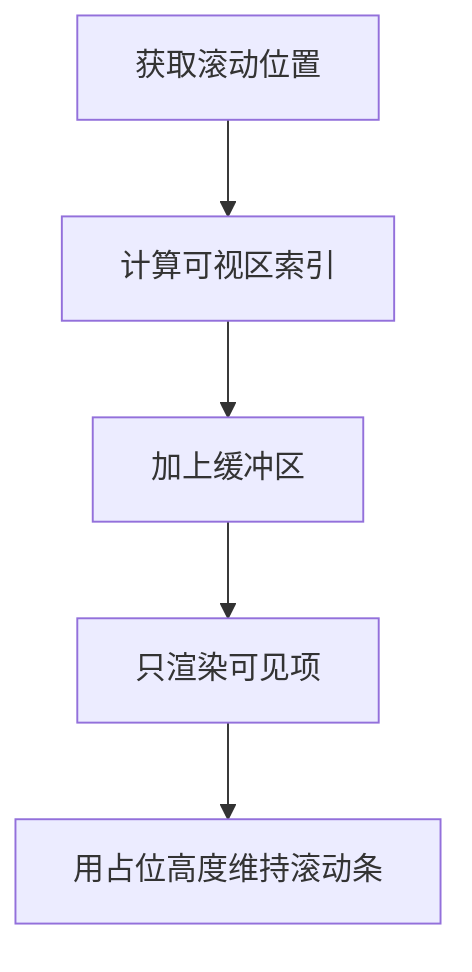

# 虚拟列表

## 定义

虚拟列表是只渲染可视区域附近列表项的性能优化技术，用较少 DOM 节点承载大量数据列表。

## 要点

- 适合上千条以上数据的表格、列表和日志视图。
- 需要处理滚动位置、动态高度、键盘访问和空状态。
- 不适合数据量很小或 SEO 强依赖的内容页。

## 渲染流程

## 案例

一个日志页面有 10 万行记录，如果直接渲染全部 DOM，首次渲染和滚动都会明显卡顿。虚拟列表只渲染当前可视区域附近的几十行，同时用总高度占位，让用户仍然感觉列表完整存在。

## 检查清单

- 列表项高度是固定还是动态。
- 是否需要键盘导航、选中状态和焦点保持。
- 滚动加载与虚拟渲染是否会互相影响。
- 是否需要保留用户滚动位置。
- 表格列固定、展开行和空状态是否兼容。

## 常见误区

- 数据量很小时过早引入虚拟列表，反而增加复杂度。
- 只处理鼠标滚动，没有处理键盘、触控和可访问性。
- 动态高度没有缓存测量结果，导致滚动跳动。
- 列表项 Key 不稳定，滚动时状态错乱。

虚拟列表属于性能优化手段，是否引入应以实际 DOM 数量、渲染耗时和滚动流畅度为依据。

## 复盘提示

如果滚动仍然卡顿，不要只看渲染项数量，还要检查每一项内部是否有复杂组件、图片解码、同步计算或频繁状态更新。虚拟列表只能减少 DOM 数量，不能自动消除单个列表项的渲染成本。

验收时应同时看首次渲染时间、滚动帧率、焦点行为和状态保持。

## 掘金补充

掘金文章《虚拟列表》把实现拆成定高和不定高两类：定高场景可以由 `scrollTop`、`itemHeight`、可视高度直接推导起止索引、可见数据和顶部偏移；不定高场景则需要“预估高度 + 渲染后测量 + 高度缓存”来修正滚动位置。工程上还要给可视区上下增加缓冲项，避免快速滚动时出现空白。

这个补充强化了一个边界：虚拟列表不是单纯 `slice` 数据，而是“总高度占位、可视数据替换、偏移定位、滚动事件更新”的组合。若列表项存在展开、图片加载或异步内容，高度缓存和滚动锚点比渲染数量更关键。

定高列表可以直接通过 `Math.floor(scrollTop / itemHeight)` 得到起始索引；不定高列表要维护每项的 `top`、`bottom`、`height`，滚动时用二分查找定位第一个可见项。预估高度建议偏小一些，宁可多渲染几项，也要避免首屏可视区域出现空白。

来源：[虚拟列表](https://juejin.cn/post/7121641268421066760)

## 相关概念

- [[React 性能优化实战]]
- [[前端性能优化清单]]
- [[组件设计与状态边界]]
