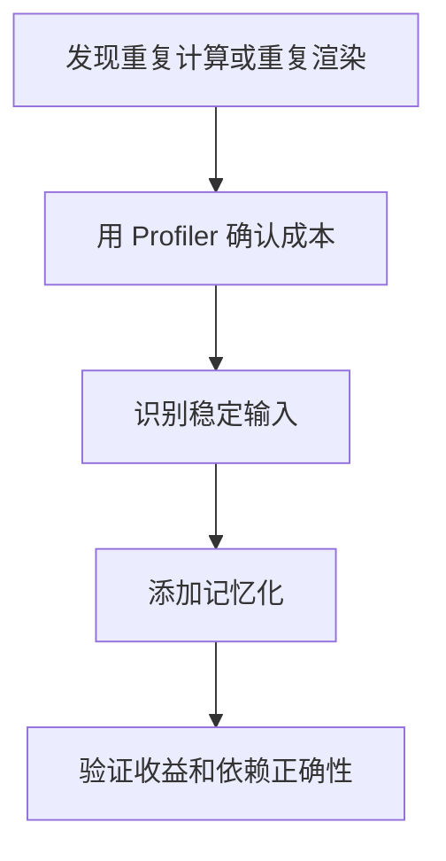

# 记忆化

## 定义

记忆化是缓存函数计算结果或引用，避免在输入未变化时重复计算或触发不必要渲染。

## 要点

- React 中常见工具是 `useMemo`、`useCallback` 和 `memo`。
- 记忆化有维护成本，应该用于明确的昂贵计算或引用稳定需求。
- 依赖数组错误会造成陈旧闭包或缓存失效。

## 使用流程

## 检查清单

- 是否有真实性能问题，而不是提前优化。
- 依赖数组是否完整。
- 记忆化对象是否作为子组件 props 造成重渲染。
- 缓存是否会保留过期数据或过多内存。
- 是否能用状态结构调整替代记忆化。

## 案例

大表格筛选结果计算昂贵时，可以用 `useMemo` 缓存筛选结果；但普通按钮点击回调不一定需要 `useCallback`，除非它会影响 memo 子组件的引用比较。

## 常见误区

- 没有性能数据就到处添加 `useMemo` 和 `useCallback`。
- 依赖数组漏项，导致使用旧数据。
- 缓存廉价计算，反而增加代码复杂度。
- 忽略组件结构问题，把所有重渲染都交给记忆化处理。

## 复盘提示

记忆化应该从 Profiler 证据出发：先确认重渲染或计算确实昂贵，再判断是缓存结果、稳定引用，还是调整状态边界。没有测量的记忆化很容易变成维护负担。

## 替代思路

很多性能问题不需要记忆化，而是需要降低组件订阅范围、拆分组件、移动状态位置或减少派生数据。先修结构，再考虑缓存，通常更稳。

## 相关概念

- [[React 性能优化实战]]
- [[选择器模式]]
- [[不可变性]]
