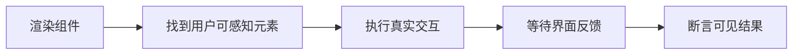

# React Testing Library 组件测试

## 定义

React Testing Library 是从用户视角测试 React 组件渲染和交互的测试工具，强调查询用户能感知的文本、角色和标签。

## 要点

- 优先使用 `getByRole`、`getByLabelText`、`getByText`。
- 避免测试内部 state 和实现细节。
- 交互测试配合 user-event 更接近真实用户操作。

## 相关概念

- [[前端测试体系总览]]
- [[Web 可访问性 A11y]]

## 测试思路

React Testing Library 的关键是“用户能否完成任务”。测试应从可见文本、按钮角色、表单标签和页面反馈出发，而不是读取组件实例或内部状态。

## 实践检查清单

- 查询优先级是否从 role、label、text 开始。
- 交互是否使用 user-event，而不是直接触发实现细节。
- 异步断言是否使用 `findBy` 或 `waitFor` 等待结果。
- Mock 是否只替换网络、路由、时间等外部依赖。
- 测试是否覆盖空态、加载态、错误态和禁用态。

## 案例

登录表单测试不应断言 `setEmail` 是否被调用，而应输入邮箱和密码、点击提交按钮，再断言加载状态、错误提示或跳转结果是否出现。

## 常见误区

- 使用 `data-testid` 替代语义化标签，错过可访问性问题。
- 断言组件内部 state，导致重构时测试失效。
- 把整个页面所有场景放进一个测试，失败时难以定位。
