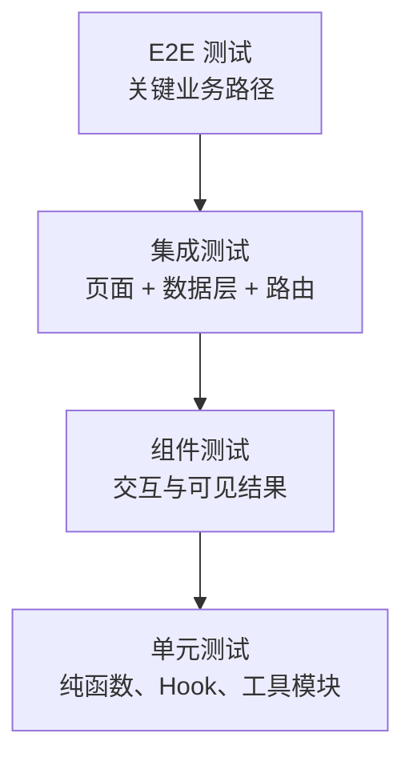
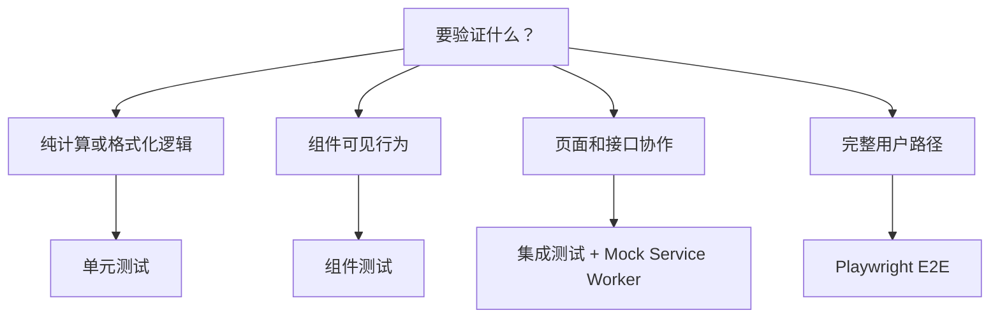

# 前端测试体系总览

## 学习目标

- 理解单元测试、组件测试、集成测试和 E2E 测试的边界。
- 掌握 Vitest、React Testing Library、Playwright 在测试体系中的位置。
- 能为前端项目设计成本合理、反馈快速的测试组合。

## 核心概念

- **测试金字塔**：底层测试数量多、速度快；端到端测试数量少、覆盖关键路径。
- **单元测试**：验证纯函数、Hook 或小模块行为。
- **组件测试**：从用户视角验证组件渲染和交互。
- **E2E 测试**：在真实浏览器中验证完整业务流程。
- **Mock 策略**：只 mock 不稳定边界，避免把实现细节写进测试。

## 分层模型

越靠下的测试越快、越稳定、越适合覆盖大量边界条件；越靠上的测试越接近真实用户，但维护成本更高。好的测试体系不是追求某一种测试最多，而是让问题在最低成本的层级被发现。

## 推荐阅读顺序

1. [[React 基础]]：理解组件行为。
2. [[Vite 原理与插件机制总览]]：理解 Vitest 与 Vite 生态关系。
3. 本文：建立前端测试全局视角。
4. 后续拆分文章：Vitest、RTL、Playwright、测试金字塔。

## 测试选择流程

例如金额格式化函数适合单元测试，搜索框输入后列表过滤适合组件测试，订单创建页和接口错误处理适合集成测试，登录后完成下单适合 E2E。

## 工程实践清单

- 纯工具函数优先写单元测试。
- 组件测试关注用户能看到和能操作的行为，而不是内部 state 名称。
- E2E 测试只覆盖登录、核心创建流程、支付、发布等关键路径。
- 修 bug 时优先补一条能复现问题的回归测试。
- 测试命名描述用户行为和预期结果，不描述内部实现步骤。
- Mock API 时优先基于 [[前后端接口契约]]，避免前端测试和真实接口结构脱节。
- CI 中区分快速测试和慢速 E2E，避免每次提交都被长链路测试拖慢。
- 对权限、表单校验、错误提示、空状态和加载状态补足组件或集成测试。

## 案例

“用户提交订单失败后看到错误提示”可以这样分层：

- 单元测试：校验订单金额、库存字段和提交参数转换。
- 组件测试：点击提交按钮后，按钮进入 loading，接口失败后显示错误提示。
- 集成测试：Mock `/api/orders` 返回 400，验证页面保持用户输入并展示后端错误消息。
- E2E 测试：只保留一条真实登录、创建订单、进入支付页的主路径。

这样既覆盖了失败细节，也避免所有异常分支都依赖真实浏览器跑完整流程。

## 后续可拆分文章

- [[Vitest 单元测试入门]]
- [[React Testing Library 组件测试]]
- [[Playwright E2E 测试实践]]
- [[前端测试金字塔]]

## 相关链接

- [[前端开发 MOC]]
- [[TypeScript 工程实践总览]]
- [[前端安全总览：XSS、CSRF 与 CSP]]
