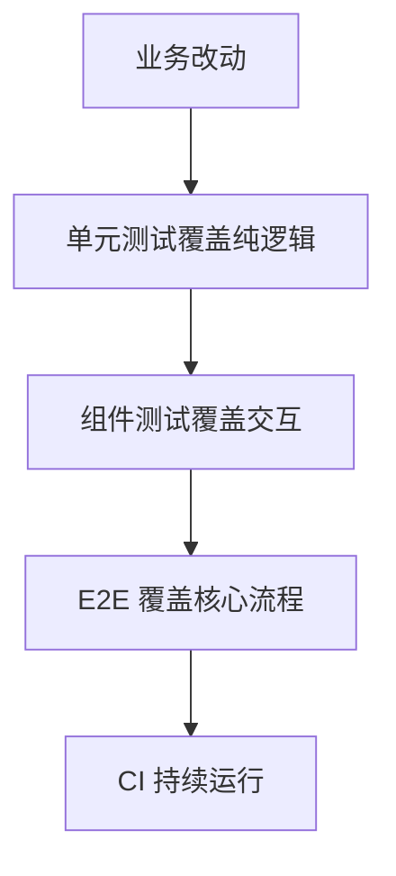

# 前端测试金字塔

## 定义

前端测试金字塔是一种测试组合策略：底层单元测试数量多、速度快；中层组件/集成测试覆盖交互；顶层 E2E 测试少量覆盖核心流程。

## 要点

- 单元测试反馈最快。
- 组件测试验证用户可见行为。
- E2E 测试验证系统集成，但成本最高。
- 缺陷修复时应补能复现问题的回归测试。

## 组合流程

## 实践检查清单

- 纯函数、工具方法和状态转换是否有单元测试。
- 组件测试是否从用户行为出发，而不是测试实现细节。
- E2E 是否只覆盖登录、支付、提交等关键路径。
- 修 bug 是否先补失败用例或回归用例。
- CI 是否能区分快速检查和慢速端到端检查。

## 案例

登录表单可以用单元测试覆盖校验函数，用组件测试覆盖输入、错误提示和提交按钮状态，用 E2E 测试覆盖真实登录成功后跳转。三层测试职责不同，不应全部靠 E2E 承担。

## 常见误区

- 所有场景都写 E2E，导致测试慢且脆弱。
- 单元测试只测实现细节，重构时大量失效。
- 组件测试绕过用户行为，直接读内部状态。
- 修复线上 bug 后没有补回归测试。

## 复盘提示

测试金字塔不是比例教条，而是反馈速度和信心的平衡。越底层越快、越上层越接近真实用户；关键业务路径需要组合覆盖。

## 质量边界

测试应证明用户可见行为，而不是证明某个私有函数被调用。当前端架构变化时，好的测试应该少改，仍能保护核心流程。

## 相关概念

- [[Vitest 单元测试入门]]
- [[React Testing Library 组件测试]]
- [[Playwright E2E 测试实践]]
