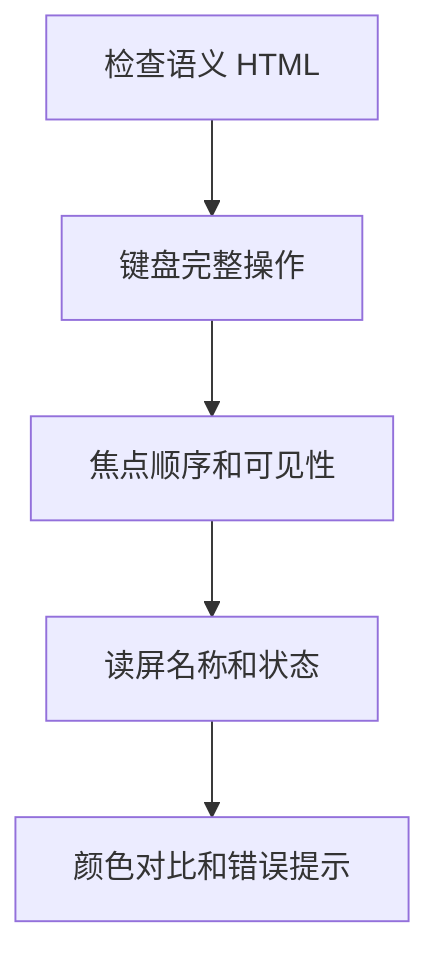

# Web 可访问性 A11y

## 定义

Web 可访问性是让不同能力、设备和输入方式的用户都能理解、导航并操作 Web 应用的工程实践。它不是视觉细节的补丁，而是 HTML 语义、键盘交互、焦点管理、颜色对比、辅助技术兼容和错误提示的整体质量标准。

## 要点

- 优先使用语义化 HTML，按钮用 `button`，导航用 `nav`，表单控件配套 `label`。
- 所有可交互元素都应支持键盘访问，并提供清晰的焦点状态。
- 图标按钮需要可读名称，图片需要合理的替代文本或明确标记为装饰。
- 表单错误要能被视觉用户和屏幕阅读器同时感知。
- 颜色不能作为唯一信息来源，对比度需要满足可读性要求。

## 常见场景

- 弹窗打开后焦点进入弹窗，关闭后回到触发按钮。
- 下拉菜单、Tab、Combobox 等复合组件遵守键盘模式。
- 页面路由切换后更新标题，并避免焦点丢失。
- Loading、错误和空状态要有文本语义，不只依赖动画。

## 检查流程

## 实践检查清单

- 不用鼠标是否能完成核心流程。
- 图标按钮是否有可访问名称。
- 表单错误是否和字段关联。
- 弹窗是否有焦点陷阱和关闭后焦点恢复。
- 自动化测试和人工键盘测试是否都覆盖。

## 案例

一个删除确认弹窗打开后，焦点应进入弹窗标题或第一个按钮，Tab 只能在弹窗内部循环，Esc 或取消按钮关闭后焦点回到原删除按钮。否则键盘用户会迷失上下文。

## 相关概念

- [[html/01-HTML基础入门|HTML 语义化]]
- [[设计系统总览]]
- [[前端测试体系总览]]
- [[React 性能优化]]
- [[前端安全总览：XSS、CSRF 与 CSP]]
