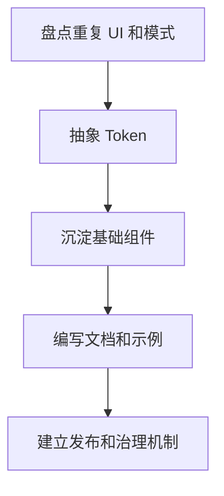

# 设计系统总览

## 定义

设计系统是一套把产品视觉语言、交互模式、组件 API、设计 Token、文档和治理流程统一起来的系统。它的价值不只是复用 UI 组件，而是让产品在多个页面、团队和版本中保持一致、可维护和可演进。

## 核心组成

- **设计 Token**：颜色、字号、间距、圆角、阴影、动效时长等基础变量。
- **基础组件**：按钮、输入框、菜单、弹窗、表格、表单、提示等可组合单元。
- **模式规范**：筛选、批量操作、空状态、错误处理、权限不可见等业务交互模式。
- **文档与示例**：说明组件意图、属性、可访问性约束和禁用场景。
- **治理机制**：新增组件、破坏性变更、版本发布和废弃策略。

## 工程实践

- 组件 API 要表达业务意图，避免把所有视觉细节暴露成随意参数。
- 设计 Token 应贯穿 Figma、CSS 变量和组件库主题。
- 组件测试覆盖交互、键盘访问和关键视觉状态。
- 业务组件沉淀前先验证复用频率，避免组件库变成杂物间。

## 建设流程

## 实践检查清单

- Token 是否同时服务设计稿和代码。
- 组件是否有明确适用场景和禁用场景。
- 组件 API 是否稳定且可组合。
- 是否覆盖键盘、焦点、错误和禁用状态。
- 是否有版本发布、废弃和迁移说明。

## 案例

按钮组件不应只有颜色和尺寸参数，还应明确 primary、secondary、danger、loading、disabled 等语义状态。这样业务使用时表达意图，而不是直接拼接视觉样式。

## 掘金文章补充

掘金文章《探索 Design Token》把设计系统拆成设计语言和模式库，并强调 Design Token 是连接设计工具和代码实现的中间层。Token 用平台无关的名称表达设计决策，例如颜色、字号、间距、圆角、阴影，再通过转换工具输出为 CSS 变量、平台常量或组件主题配置。

Token 的价值不只是“把颜色变量化”，而是建立设计和研发的共同语言。设计稿中的品牌色、文本层级、间距阶梯、阴影和动效时长都应进入可版本化的 Token；组件库再消费这些 Token。这样设计变更可以通过 Token 发布传递到代码，减少人工对照标注和视觉还原误差。

来源：[探索 Design Token](https://juejin.cn/post/7046936194743009311)

## 相关概念

- [[Web 可访问性 A11y]]
- [[组件设计与状态边界]]
- [[TypeScript 工程实践总览]]
- [[前端测试体系总览]]
- [[css/MOC|CSS 架构]]
